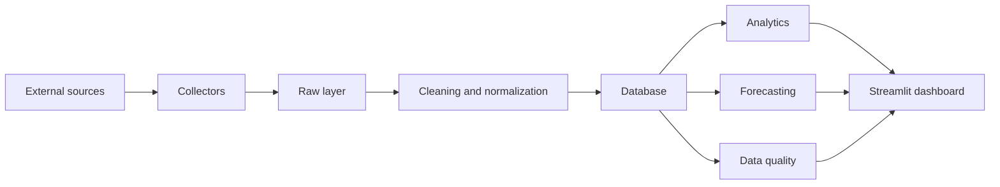

# Project Germania

🇺🇸 English | 🇨🇳 [简体中文](README_CN.md)

German automotive market price and registration intelligence platform.

Project Germania is a long-term data engineering and market intelligence project
for monitoring the German passenger car market. It is designed to collect,
preserve, clean, analyze, forecast, and visualize vehicle registration and price
signals with strong emphasis on data authenticity, traceability, compliance, and
quality.

## Project Overview

Germany is one of Europe's largest automotive markets and a strategic home
market for Volkswagen, BMW, Mercedes-Benz, Audi, and other major brands. Project
Germania focuses on building a reproducible analytical system for studying:

- new vehicle registrations;
- official list prices and starting prices;
- market listing prices;
- price changes and inventory movement;
- regional differences;
- vehicle variants and powertrain types;
- exchange rates;
- data quality;
- competitive relationships between German, European, Chinese, and Tesla models.

The project is currently in the foundation phase. The repository contains the
standard Python project structure, development tooling, logging helpers, and a
minimal health check. It does not yet include real market data, database models,
web crawlers, Playwright automation, or a Streamlit dashboard.

## Project Goals

- Build a compliant and auditable data pipeline for the German automotive
  market.
- Preserve raw source files and metadata so that every derived result can be
  traced back to its origin.
- Maintain a dedicated market database for vehicles, variants, listings, prices,
  registrations, exchange rates, quality issues, and model outputs.
- Provide analytical modules for registration, price, inventory, competition,
  and research-value metrics.
- Compare forecasting models against transparent baselines before promoting
  them.
- Deliver a Chinese-language Streamlit dashboard when the data, cleaning, and
  database layers are ready.
- Keep the repository reproducible, testable, and suitable for long-term
  maintenance.

## Key Features

Planned capabilities include:

- KBA-based monthly and annual new-registration analysis;
- official manufacturer price tracking;
- listing-price and inventory monitoring from compliant sources;
- vehicle name normalization and confidence-scored matching;
- raw, clean, and analytics data layers;
- exchange-rate-aware historical price conversion;
- data quality checks for completeness, uniqueness, validity, consistency, and
  timeliness;
- incremental update logic for listing status and price observations;
- research value index (RVI) for prioritizing vehicle research;
- baseline, statistical, and optional machine-learning forecasts;
- Streamlit visualizations for market overview, model comparison, price
  monitoring, registration analysis, forecast alerts, data quality, and task
  status.

Current implemented capabilities:

- Python `src` layout;
- `pyproject.toml` project configuration;
- pytest, ruff, and black configuration;
- basic logging configuration;
- minimal package health check;
- vehicle and data source configuration loaders;
- logical data dictionary and data model documentation;
- unit tests for health, logging, vehicle configuration, and source
  configuration.

## System Architecture

The intended architecture is layered so that raw data, cleaned data, analysis,
and user-facing views remain clearly separated.



The current repository implements only the project foundation and minimal local
package health check. Database design, collectors, cleaning rules, forecasting,
and dashboard implementation are future stages.

## Data Sources

Planned authoritative and supporting sources:

- **KBA**: German Federal Motor Transport Authority. Primary source for new
  vehicle registrations. Project sales metrics should prefer KBA registration
  data and should not treat listing counts as sales.
- **ACEA**: European Automobile Manufacturers' Association. Supporting source
  for European market context, powertrain market share, and country-level
  comparisons.
- **German manufacturer websites**: official base prices, starting prices,
  model-year information, variants, powertrains, range, power, and official
  promotions.
- **AutoScout24 and Mobile.de**: listing prices, inventory signals, location,
  mileage, first registration year, seller type, vehicle status, and price
  history when compliant collection is possible.
- **Exchange-rate sources**: preferably the European Central Bank or another
  authoritative public source. Historical conversion must use the exchange rate
  for the relevant date.

This project does not bypass captchas, logins, access controls, anti-bot
systems, or Cloudflare protections. If a source is unsuitable for automated
collection, the project should use manual imports, official downloadable files,
or compliant third-party adapters instead.

## Research Vehicles

Initial research vehicles are defined by the project specification and should be
maintained in configuration files in future stages, preferably
`config/vehicles.yaml`.

German benchmark models:

- Volkswagen Golf;
- Volkswagen Tiguan.

Mainstream European electric models:

- Volkswagen ID.3;
- Volkswagen ID.4;
- Skoda Enyaq;
- BMW iX1;
- Mercedes-Benz EQA;
- Audi Q4 e-tron;
- Tesla Model Y.

Key Chinese-brand models:

- BYD Seal U;
- BYD Atto 3 / Yuan PLUS;
- MG4;
- XPeng G6;
- Leapmotor C10;
- NIO EL6.

Vehicle names must not be hard-coded across multiple Python modules. Future
model expansion should start from configuration rather than collector logic.

## Technology Stack

- **Language**: Python 3.12 or later.
- **Project layout**: `src` layout.
- **Packaging**: `pyproject.toml` with editable installs.
- **Testing**: pytest.
- **Linting and formatting**: ruff and black.
- **Logging**: Python standard `logging`.
- **Paths**: `pathlib`.
- **Future data collection**: httpx, pandas, openpyxl, BeautifulSoup or
  selectolax, and Playwright only when necessary and compliant.
- **Future database layer**: SQLAlchemy 2.x, Alembic, SQLite for local
  development, PostgreSQL for deployment.
- **Future analytics and forecasting**: pandas, numpy, scipy, statsmodels,
  scikit-learn, and optional Prophet, XGBoost, or LightGBM only when the data
  volume supports them.
- **Future visualization**: Streamlit and Plotly.

## Project Structure

```text
project-germania/
├── AGENTS.md
├── README.md
├── README_CN.md
├── pyproject.toml
├── .env.example
├── .gitignore
├── config/
│   ├── vehicles.yaml
│   └── sources.yaml
├── data/
│   ├── raw/
│   ├── interim/
│   ├── processed/
│   └── exports/
├── database/
├── docs/
│   ├── architecture_review.md
│   ├── database_design_decisions.md
│   ├── database_er_design.md
│   ├── database_field_mapping.md
│   ├── data_dictionary.md
│   ├── data_model.md
│   └── naming_conventions.md
├── logs/
├── notebooks/
├── scripts/
├── src/
│   └── germania/
│       ├── collectors/
│       ├── cleaning/
│       ├── database/
│       ├── analytics/
│       ├── forecasting/
│       ├── dashboard/
│       ├── quality/
│       └── utils/
└── tests/
    ├── fixtures/
    ├── unit/
    └── integration/
```

## Development Environment

Requirements:

- Python 3.12 or later;
- pip;
- Git.

Check Python:

```powershell
python --version
```

Create and activate a virtual environment:

```powershell
python -m venv .venv
.\.venv\Scripts\Activate.ps1
```

## Installation

Install the project and development dependencies:

```powershell
pip install -e ".[dev]"
```

## Running

Run the local health check:

```powershell
python -c "from germania.health import get_health_status; print(get_health_status())"
```

Expected output:

```text
HealthStatus(service='project-germania', status='ok', version='0.1.0')
```

Run tests and code checks:

```powershell
pytest
ruff check .
black --check .
```

## Environment Variables

Copy the template before adding local configuration:

```powershell
Copy-Item .env.example .env
```

`.env` is ignored by Git and must not be committed.

| Variable | Purpose |
| --- | --- |
| `LOG_LEVEL` | Logging level for local runs. |
| `LOG_FILE` | Optional local log file path. |
| `RAW_DATA_DIR` | Future raw data directory. |
| `INTERIM_DATA_DIR` | Future interim data directory. |
| `PROCESSED_DATA_DIR` | Future processed data directory. |
| `EXPORT_DATA_DIR` | Future export directory. |
| `REQUEST_TIMEOUT` | Future network request timeout. |
| `MAX_REQUESTS_PER_RUN` | Future per-run request limit. |
| `PLAYWRIGHT_HEADLESS` | Future Playwright headless mode flag. |
| `DATABASE_URL` | Reserved for the future database phase. |

Do not store real passwords, keys, production database URLs, or private paths in
tracked files.

## Development Roadmap

1. [x] Phase 1: project foundation.
2. [x] Vehicle configuration.
3. [x] Data sources and data dictionary.
4. [x] Phase 3.5: architecture review.
5. [x] Phase 4: database ER design.
6. [ ] SQLAlchemy and Alembic setup.
7. [ ] Unified collector interface.
8. [ ] Exchange-rate data.
9. [ ] KBA registration data.
10. [ ] One manufacturer website source.
11. [ ] One-model AutoScout24 collection.
12. [ ] Data cleaning.
13. [ ] Incremental updates.
14. [ ] Vehicle expansion.
15. [ ] Second listing platform.
16. [ ] Analytics metrics.
17. [ ] Forecasting models.
18. [ ] Streamlit dashboard.
19. [ ] GitHub Actions.
20. [ ] PostgreSQL and Docker.
21. [ ] Final audit.

## Data Principles

- Do not fabricate KBA data, website results, tests, or model outputs.
- Treat KBA new registrations as the preferred source for sales-related metrics.
- Do not describe listing counts, inventory counts, or search-result counts as
  real sales.
- Treat listing prices as asking prices, not transaction prices.
- Store raw data immutably with source URLs, collection time, and hashes.
- Use historical exchange rates for historical price conversion.
- Keep official prices, promotional prices, post-subsidy prices, financing
  payments, and leasing payments separate.
- Validate external inputs and record data quality issues instead of silently
  filling unknown values.
- Keep dashboards and analysis based on database records, not hard-coded demo
  numbers.

## Current Status

The current repository has completed the foundation, configuration, logical
design, architecture review, and database ER design stages:

- standard project directories created;
- editable Python package initialized;
- pytest, ruff, and black configured;
- basic logging helper added;
- health check module added;
- unit tests added;
- initial Git repository and first commit created;
- `config/vehicles.yaml` added for canonical research vehicles;
- `config/sources.yaml` added for planned data sources;
- source and vehicle configuration loaders added;
- `docs/data_dictionary.md`, `docs/data_model.md`,
  `docs/naming_conventions.md`, and `docs/architecture_review.md` added as
  logical specifications and review records;
- `docs/database_er_design.md`, `docs/database_field_mapping.md`, and
  `docs/database_design_decisions.md` added as database design documents.

Not started yet:

- actual database implementation;
- SQLAlchemy models;
- Alembic migrations;
- collectors or crawlers;
- real website connections;
- real German automotive market data;
- Streamlit dashboard.

## Future Work

Near-term work should use the database ER design as the gate before SQLAlchemy
or Alembic work begins:

- keep source and vehicle configuration changes reviewable;
- keep data dictionary fields and naming conventions aligned with the logical
  model;
- keep physical tables, constraints, and indexes traceable to the database ER
  design and field mapping;
- keep collectors, crawlers, dashboards, and real website connections out of
  scope until the relevant stage begins.

The project should first run a complete compliant workflow for one vehicle,
preferably Volkswagen Golf, before expanding to all research models.

## Contributing

Contributions should preserve the project's highest priorities: data
authenticity, traceability, compliance, quality, and stability.

Before contributing:

- read `AGENTS.md`;
- keep changes focused;
- avoid unrelated refactors;
- add or update tests for new functionality;
- do not commit secrets, local databases, raw data dumps, logs, or generated
  cache files;
- do not add collectors that bypass access controls, captchas, logins, or
  anti-bot systems;
- clearly distinguish source data, estimates, forecasts, and derived metrics.

Useful local checks:

```powershell
pytest
ruff check .
black --check .
```

## License

No open-source license has been selected yet. Until a license file is added,
all rights are reserved by default. Do not reuse this project as open-source
software until the license is clarified.
