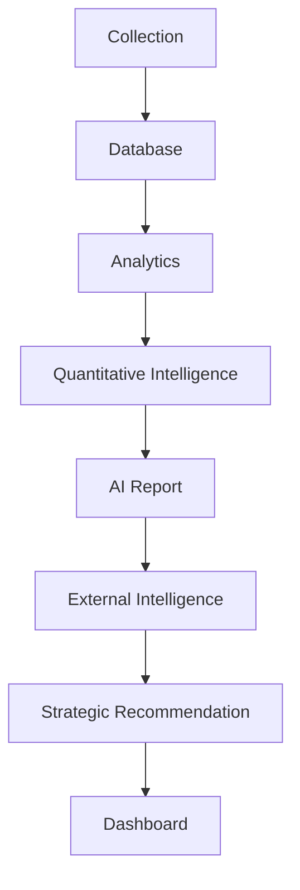

# Project Germania V2.0

[English](README.md) | [简体中文](README_CN.md)

**AI-powered German Automotive Market Intelligence Platform**

Project Germania is an auditable market-intelligence platform for the German
automotive market. It connects compliant vehicle-listing collection, read-only
market analytics, transparent quantitative models, AI-assisted reporting,
external evidence, strategic recommendations, and an enterprise Streamlit
Dashboard.

The platform treats marketplace prices as asking prices rather than transaction
prices, and marketplace inventory as listing activity rather than vehicle
sales. KBA new registrations remain the preferred source for sales-related
market analysis.

## Core Architecture



The layers have explicit boundaries:

- **Collection** preserves bounded, traceable marketplace observations.
- **Database** stores listings and price observations; Dashboard access is
  read-only.
- **Analytics** produces daily vehicle and brand market intelligence.
- **Quantitative Intelligence** adds explainable pressure, momentum, and peer
  benchmarking models without changing the Opportunity Score.
- **AI Report** converts verified analytics into a narrative report through a
  replaceable provider interface with a deterministic local fallback.
- **External Intelligence** normalizes official KBA, ACEA, government,
  manufacturer-news, RSS, report, and public-video metadata.
- **Strategic Recommendation** combines internal metrics and traceable external
  evidence into opportunity, risk, and recommendation sections.
- **Dashboard** dynamically reads SQLite and generated report artifacts without
  writing to the production database.

## Core Features

- Automated German automotive market monitoring
- Vehicle opportunity scoring
- Price intelligence
- Explainable Price Pressure, Inventory Pressure, and Market Momentum models
- Dynamic peer vehicle benchmarking
- AI market report generation with local fallback
- Evidence-backed external intelligence and unified content feed
- Global automotive intelligence hub
- Strategic analysis dashboard
- Atomic pipeline artifacts, status tracking, and failure isolation
- Eight-page responsive Streamlit information architecture

## Dashboard

The V2 Dashboard contains eight core pages:

1. **Executive Overview** — market KPIs, pipeline status, AI summary,
   opportunity, risk, and quantitative intelligence.
2. **Global Automotive Intelligence Hub** — official news, reports, videos,
   evidence metadata, filters, and market-data associations.
3. **Vehicle Intelligence** — comparable vehicle rankings, inventory, prices,
   trends, pressure, momentum, and Opportunity Score.
4. **Brand Competition** — brand inventory, pricing, powertrain mix, and model
   coverage.
5. **Price Intelligence** — asking-price movements, pressure ranking, and
   price/inventory interaction.
6. **Vehicle Analysis** — vehicle-level distributions, historical trends,
   quantitative model explanations, and dynamic peer benchmarking.
7. **Search Center** — read-only SQLite search, sorting, CSV export, listing
   details, and source links.
8. **Data Quality** — pipeline, scheduler, collection, database completeness,
   matching, and external-source status.

## Quantitative Intelligence

V2 includes transparent, bounded 0–100 models:

- **Opportunity Score** evaluates inventory attractiveness, price
  competitiveness, price trend, and market activity.
- **Price Pressure Index** increases when asking prices decline, inventory
  expands, and observed price dispersion increases.
- **Inventory Pressure Index** evaluates active listing levels, inventory
  change, new-listing activity, and market activity.
- **Market Momentum Score** combines listing activity, price and inventory
  trends, Opportunity Score, and market activity.
- **Comparable Vehicle Benchmarking** dynamically controls price band, vehicle
  segment, powertrain, body style, and market attributes before calculating
  peer gaps, ranks, and percentiles.

Models return `insufficient_data` instead of fabricating missing inputs. Full
formula and matching documentation is available in
[Phase 11 Quantitative Intelligence](docs/phase_11_quantitative_intelligence.md)
and [Phase 12 Comparable Vehicle Benchmarking](docs/phase_12_comparable_vehicle_benchmarking.md).

## Technology Stack

- Python 3.12
- SQLite and SQLAlchemy 2.x
- Streamlit
- Pandas and NumPy
- Plotly / Altair
- Playwright
- Pytest, Ruff, and Black
- Analytics and intelligence pipeline

No paid AI or external-data API is required. Network providers use public,
compliant sources and cached stale data where policy permits; the system does
not bypass authentication, captchas, TLS validation, or access restrictions.

## Repository Structure

```text
project-germania/
├── ai/                         # AI analyst, providers, fallback, report generation
├── config/                     # Vehicle, collection, and external-source configuration
├── dashboard/                  # Eight-page Streamlit app, components, services, tests
├── demo/                       # Public synthetic SQLite and report bundle
├── docs/                       # Architecture and quantitative-model documentation
├── external_intelligence/      # KBA, RSS, official news/report/video providers
├── pipeline/                   # Atomic orchestration and stage status handling
├── scripts/                    # Collection, scheduler, import, export, and operations tools
├── src/germania/analytics/     # Market metrics, quantitative models, peer benchmarking
├── strategic/                  # Evidence-backed strategic analysis and reporting
├── tests/                      # Unit and integration tests
├── .env.example
├── pyproject.toml
├── requirements.txt            # Streamlit Cloud dependency entry point
└── README.md
```

Runtime databases, raw data, caches, logs, generated reports, report archives,
browser-validation output, and virtual environments are intentionally excluded
from version control.

## Generated Artifacts

The production pipeline generates the following files locally under `reports/`:

```text
daily_market_intelligence.json
daily_ai_market_report.md
external_intelligence.json
external_intelligence/content_feed.json
strategic_market_report.md
pipeline_status.json
```

Each downstream stage depends on a successful upstream stage. Atomic writes and
archives protect the last valid report when a stage fails. These generated
artifacts are runtime data and are not committed to Git.

## Online Demo

The public Streamlit deployment uses the bundled [`demo/`](demo/README.md)
dataset and does not require marketplace collection, production credentials, or
a production SQLite database. The public URL can be added here after the
Streamlit Community Cloud application is created.

Deployment settings:

- repository: `LHX650/Project-Germania`
- branch: `develop-v2-intelligence`
- main file: `dashboard/app.py`
- environment/secret: `DEMO_MODE = "true"`

See the [Streamlit Cloud deployment checklist](docs/streamlit_cloud_deployment.md).

## Quick Demo

Install the Dashboard dependencies:

```powershell
pip install -r dashboard/requirements.txt
```

Start the public demo in PowerShell:

```powershell
$env:DEMO_MODE = "true"
streamlit run dashboard/app.py
```

On Bash-compatible systems:

```bash
DEMO_MODE=true streamlit run dashboard/app.py
```

The bundled values are synthetic, anonymized, and read-only. Public vehicle and
brand labels are retained for usability, while listing IDs, sellers, locations,
prices, observations, inventory, scores, and narrative conclusions are demo
fixtures. Official external links are stored as short public metadata only.

### Production and Demo isolation

| Mode | Setting | SQLite | Reports | Collection/Pipeline |
| --- | --- | --- | --- | --- |
| Production (default) | `DEMO_MODE=false` or unset | `database/project_germania_live.sqlite3` | `reports/` | Full governed production workflow |
| Public demo | `DEMO_MODE=true` | `demo/project_germania_demo.sqlite3` | `demo/` | Not started or called by the Dashboard |

Both modes use SQLite read-only URI connections. Demo Mode changes only the
Dashboard input paths; it does not invoke or alter Collector, Scheduler,
Pipeline, Analytics, AI, or Strategic processing.

## Quick Start

Create a local environment and install the package:

```powershell
python -m venv .venv
.venv\Scripts\Activate.ps1
python -m pip install -e .
python -m pip install -r dashboard\requirements.txt
```

Copy the environment template and set a local database URL:

```powershell
Copy-Item .env.example .env
$env:GERMANIA_DATABASE_URL = "sqlite:///database/project_germania_live.sqlite3"
```

Run the intelligence pipeline or Dashboard:

```powershell
python -m pipeline
python -m streamlit run dashboard/app.py
```

The Windows scheduler wrapper invokes `python -m pipeline`; scheduler
installation and updates remain explicit administrative operations.

## Testing

```powershell
pytest
ruff check .
black --check .
```

Tests use fixtures, mocks, and temporary databases. They do not require live
websites and must not leave SQLite databases or raw output in the repository.

## Screenshots

Release screenshots belong under [`docs/screenshots/`](docs/screenshots/README.md).
Use optimized static images with no credentials, local paths, personal data, or
database contents. Automated browser-validation screenshots under `reports/`
remain local and are not committed.

Recommended public-release captures include Executive Overview, Tesla Model Y
peer benchmarking, Global Automotive Intelligence Hub, Search Center, and Data
Quality running with the visible Demo Mode disclosure.

## Data and Compliance Principles

- Never fabricate registrations, listings, prices, news, reports, videos, or
  URLs.
- Never describe listing counts as sales or asking prices as transaction
  prices.
- Keep observed facts, derived metrics, model outputs, AI text, and strategic
  recommendations distinguishable and traceable.
- Do not bypass login, captchas, access controls, anti-bot protections, or TLS
  validation.
- Keep secrets in environment variables; never commit `.env`, databases, raw
  data, caches, logs, or generated reports.

## Release Branch

Project Germania V2.0 development is maintained on
`develop-v2-intelligence`. This release preparation does not merge or modify
`main`.

## License

No open-source license has been selected. All rights are reserved unless a
license is added explicitly.
