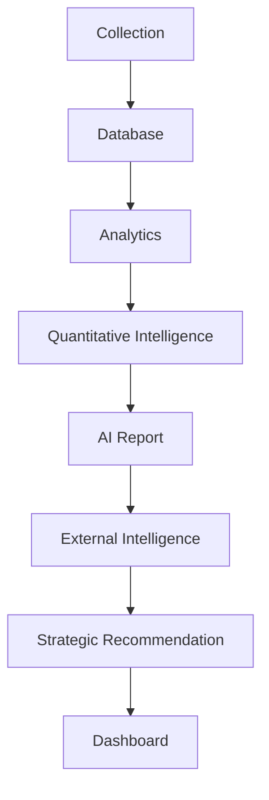

# Project Germania V2.0

[English](README.md) | [简体中文](README_CN.md)

**AI 驱动的德国汽车市场智能情报平台**

Project Germania 是一套面向德国汽车市场、可审计且可解释的市场情报平台。系统连接合规挂牌数据采集、只读市场分析、透明量化模型、AI 报告、外部证据、战略建议和企业级 Streamlit Dashboard。

平台将 Marketplace Price 明确定义为挂牌价，而不是成交价；将 Marketplace Inventory 定义为挂牌活动，而不是汽车销量。涉及销量的市场分析应优先使用 KBA 新车注册量。

## 核心架构



- **Collection**：保存有边界、可追溯的市场挂牌观察。
- **Database**：保存挂牌与价格观察；Dashboard 始终只读。
- **Analytics**：生成每日车型与品牌市场指标。
- **Quantitative Intelligence**：提供价格压力、库存压力、市场动能和可比车型分析，不修改 Opportunity Score。
- **AI Report**：通过可替换 Provider 和确定性本地 fallback，将真实 Analytics 转换为市场报告。
- **External Intelligence**：统一 KBA、ACEA、政府、品牌官方新闻、RSS、报告和公开视频元数据。
- **Strategic Recommendation**：将内部指标与可追溯外部证据转换为机会、风险和建议。
- **Dashboard**：动态读取 SQLite 与报告工件，不写入生产数据库。

## 核心功能

- 德国汽车市场自动监测
- Vehicle Opportunity Score
- Price Intelligence
- Price Pressure、Inventory Pressure 与 Market Momentum 可解释模型
- 动态可比车型 Peer Benchmarking
- 支持本地 fallback 的 AI 市场报告
- Evidence-backed External Intelligence 与统一内容 Feed
- Global Automotive Intelligence Hub
- Strategic Analysis Dashboard
- 原子写入、旧报告保护与阶段状态记录
- 八个响应式 Streamlit 核心页面

## Dashboard 页面

1. **Executive Overview**：市场 KPI、Pipeline 状态、AI 摘要、机会、风险和量化情报。
2. **Global Automotive Intelligence Hub**：官方新闻、报告、视频、证据状态、筛选和市场指标关联。
3. **Vehicle Intelligence**：同类车型排名、库存、价格、趋势、压力、动能和 Opportunity Score。
4. **Brand Competition**：品牌库存、价格、动力结构和车型覆盖。
5. **Price Intelligence**：挂牌价格变化、压力排名以及价格与库存联动。
6. **Vehicle Analysis**：单车型分布、历史趋势、量化模型解释和动态 Peer Benchmark。
7. **Search Center**：SQLite 只读查询、排序、CSV 导出、挂牌详情和原始链接。
8. **Data Quality**：Pipeline、Scheduler、采集、数据库完整率、匹配质量和外部来源状态。

## 量化市场情报

- **Opportunity Score**：评估库存吸引力、价格竞争力、价格趋势和市场活动。
- **Price Pressure Index**：挂牌价格下降、库存增加和价格离散增强时压力上升。
- **Inventory Pressure Index**：评估当前挂牌量、库存变化、新增挂牌和市场活动。
- **Market Momentum Score**：综合挂牌活动、价格与库存趋势、Opportunity Score 和市场活动。
- **Comparable Vehicle Benchmarking**：动态控制价格带、车型级别、动力类型、车身形式和市场属性，再计算 Peer Gap、排名与百分位。

输入不足时模型返回 `insufficient_data`，不会填充假值。完整公式见 [Phase 11 量化情报说明](docs/phase_11_quantitative_intelligence.md) 和 [Phase 12 可比车型说明](docs/phase_12_comparable_vehicle_benchmarking.md)。

## 技术栈

- Python 3.12
- SQLite 与 SQLAlchemy 2.x
- Streamlit
- Pandas 与 NumPy
- Plotly / Altair
- Playwright
- Pytest、Ruff 与 Black
- Analytics Intelligence Pipeline

项目不强制调用付费 AI 或外部数据 API，不绕过登录、验证码、TLS 校验或访问限制。

## 项目结构

```text
project-germania/
├── ai/                         # AI Analyst、Provider、Fallback 与报告生成
├── config/                     # 车型、采集和外部来源配置
├── dashboard/                  # 八个页面、组件、只读服务与 AppTest
├── docs/                       # 架构和量化模型文档
├── external_intelligence/      # KBA、RSS、官方新闻/报告/视频 Provider
├── pipeline/                   # 自动编排、原子写入和阶段状态
├── scripts/                    # 采集、Scheduler、导入、导出与运维脚本
├── src/germania/analytics/     # 市场指标、量化模型与 Peer Benchmark
├── strategic/                  # Evidence-backed 战略分析与报告
├── tests/                      # 单元测试与集成测试
├── .env.example
├── pyproject.toml
└── README.md
```

数据库、Raw Data、缓存、日志、每日生成报告、报告归档、浏览器验收产物和虚拟环境均不进入版本控制。

## 运行时工件

Pipeline 在本地 `reports/` 下生成：

```text
daily_market_intelligence.json
daily_ai_market_report.md
external_intelligence.json
external_intelligence/content_feed.json
strategic_market_report.md
pipeline_status.json
```

下游阶段仅在上游成功后执行；原子写入和归档机制会保护上一份有效报告。这些文件属于运行数据，不提交到 Git。

## 快速开始

```powershell
python -m venv .venv
.venv\Scripts\Activate.ps1
python -m pip install -e .
python -m pip install -r dashboard\requirements.txt
Copy-Item .env.example .env
$env:GERMANIA_DATABASE_URL = "sqlite:///database/project_germania_live.sqlite3"
python -m pipeline
python -m streamlit run dashboard/app.py
```

Windows Scheduler 包装脚本执行 `python -m pipeline`；安装或更新计划任务仍是显式管理操作。

## 测试

```powershell
pytest
ruff check .
black --check .
```

测试使用 fixture、mock 和临时数据库，不依赖实时网站，也不应在仓库留下 SQLite 或 Raw Output。

## 项目截图

正式发布截图放在 [`docs/screenshots/`](docs/screenshots/README.md)。截图不得包含凭据、本地路径、个人数据或数据库敏感内容。`reports/` 下的自动浏览器验收截图仅保留在本地，不提交 Git。

## 数据真实性与合规

- 不伪造注册量、挂牌、价格、新闻、报告、视频或 URL。
- 不将挂牌数量描述为销量，不将挂牌价描述为成交价。
- 明确区分来源事实、衍生指标、模型输出、AI 文本和战略建议。
- 不绕过登录、验证码、访问控制、反爬保护或 TLS 校验。
- 密钥只通过环境变量管理；不提交 `.env`、数据库、Raw Data、缓存、日志和生成报告。

## 发布分支

Project Germania V2.0 在 `develop-v2-intelligence` 分支维护。本次发布准备不会合并或修改 `main`。

## License

项目尚未选择开源许可证。在明确添加许可证之前，默认保留所有权利。
