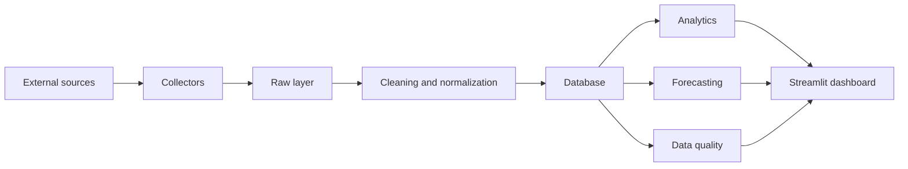

# Project Germania

🇨🇳 简体中文 | 🇺🇸 [English](README.md)

德国汽车市场价格与销量智能监测平台。

Project Germania 是一个长期数据工程与市场研究项目，面向德国乘用车市场，目标是对车辆注册量与价格信号进行采集、留存、清洗、分析、预测和可视化。项目把数据真实性、可追溯性、合规性和数据质量放在优先位置。

## 项目概览

德国是欧洲最大的汽车市场之一，也是大众、宝马、奔驰、奥迪等主要品牌的核心市场。Project Germania 希望建立一套可复现的分析系统，用于研究：

- 新车注册量；
- 官方指导价和官方起售价；
- 市场挂牌价；
- 价格变化和库存变化；
- 地区差异；
- 车型版本和动力类型；
- 汇率；
- 数据质量；
- 德国、欧洲、中国品牌以及特斯拉车型之间的竞争关系。

项目当前已经包含 Repository 基础、基于 fixture 的 KBA 与官方价格导入、挂牌持久化、本地 AutoScout24 fixture 管道、合规的单页 Playwright AutoScout24 工作流，以及有边界的多页批量采集基础；尚未包含生产数据库实例、无边界挂牌爬取、代理、验证码处理或 Streamlit Dashboard。

## 项目目标

- 建立一套合规、可审计的德国汽车市场数据管道。
- 保存原始文件和来源元数据，使所有衍生结果都可以追溯回来源。
- 构建专属市场数据库，覆盖车型、版本、挂牌、价格、注册量、汇率、数据质量问题和模型输出。
- 提供注册量、价格、库存、竞争关系和车型研究价值等分析模块。
- 所有预测模型都先与透明基线模型比较，再决定是否采用。
- 在数据、清洗和数据库层稳定后，交付中文 Streamlit 可视化平台。
- 保持仓库可复现、可测试，并适合长期维护。

## 核心功能

计划中的能力包括：

- 基于 KBA 的月度和年度新车注册量分析；
- 汽车厂商官方价格跟踪；
- 在合规前提下监测挂牌价格和库存信号；
- 车型名称标准化和带置信度的匹配；
- Raw、Clean、Analytics 三层数据结构；
- 基于历史汇率的历史价格换算；
- 完整性、唯一性、有效性、一致性和及时性数据质量检查；
- 挂牌状态与价格观察的增量更新逻辑；
- 用于车型研究优先级判断的 RVI 研究价值指数；
- 基线模型、统计模型和可选机器学习模型预测；
- 市场总览、车型对比、价格监控、注册量分析、预测预警、数据质量和任务状态等 Streamlit 页面。

当前已经实现的能力：

- Python `src` 目录布局；
- `pyproject.toml` 项目配置；
- pytest、ruff 和 black 配置；
- 基础日志配置；
- 最小健康检查模块；
- 车型和数据源配置读取模块；
- 逻辑数据字典和逻辑数据模型文档；
- SQLAlchemy 2.x ORM 模型；
- Alembic 迁移环境和首个 schema 迁移；
- 健康检查、日志工具、车型配置、数据源配置、ORM 元数据和迁移行为的单元测试。

## 系统架构

项目采用分层架构，确保原始数据、清洗数据、分析逻辑和用户界面相互隔离。



当前仓库只实现项目基础工程和最小本地健康检查。数据库设计、采集器、清洗规则、预测模型和 Dashboard 都属于后续阶段。

## 数据来源

计划使用的权威和辅助数据源包括：

- **KBA**：德国联邦机动车管理局。新车注册量的首选来源。项目中的销量相关指标应优先使用 KBA 注册量，不应把挂牌数量描述为销量。
- **ACEA**：欧洲汽车制造商协会。用于欧洲市场背景、动力类型市场份额和国家维度对比。
- **汽车厂商德国官网**：官方基础价格、官方起售价、年款、版本、动力形式、续航、功率和官方促销信息。
- **AutoScout24 和 Mobile.de**：在合规采集可行时，用于挂牌价、库存信号、地区、里程、首次注册年份、卖家类型、车辆状态和价格历史。
- **汇率来源**：优先使用欧洲中央银行或其他权威公开来源。历史价格换算必须使用对应日期的历史汇率。

本项目不绕过验证码、登录、访问控制、反爬机制或 Cloudflare 防护。如果某个来源不适合自动化采集，应使用人工导入、官方下载文件或合规第三方数据适配器。

## 研究车型

初始研究车型来自项目规范。后续阶段应通过配置文件维护，优先使用 `config/vehicles.yaml`。

德国传统基准车型：

- 大众高尔夫；
- 大众途观。

欧洲主流新能源车型：

- 大众 ID.3；
- 大众 ID.4；
- 斯柯达 Enyaq；
- 宝马 iX1；
- 奔驰 EQA；
- 奥迪 Q4 e-tron；
- 特斯拉 Model Y。

中国品牌重点车型：

- 比亚迪 Seal U / 海豹 U；
- 比亚迪 Atto 3 / 元 PLUS；
- MG4；
- 小鹏 G6；
- 零跑 C10；
- 蔚来 EL6。

车型名称不得分散硬编码在多个 Python 模块中。未来新增车型应优先更新配置文件，而不是直接修改采集器逻辑。

## 技术栈

- **语言**：Python 3.12 或更高版本。
- **项目布局**：`src` 布局。
- **包管理**：通过 `pyproject.toml` 支持可编辑安装。
- **测试**：pytest。
- **代码检查和格式化**：ruff 和 black。
- **日志**：Python 标准库 `logging`。
- **路径处理**：`pathlib`。
- **后续数据采集**：httpx、pandas、openpyxl、BeautifulSoup 或 selectolax；Playwright 只在必要且合规时使用。
- **后续数据库层**：SQLAlchemy 2.x、Alembic、本地开发 SQLite、部署 PostgreSQL。
- **后续分析与预测**：pandas、numpy、scipy、statsmodels、scikit-learn，以及在数据量足够时可选 Prophet、XGBoost 或 LightGBM。
- **后续可视化**：Streamlit 和 Plotly。

## 项目结构

```text
project-germania/
├── AGENTS.md
├── README.md
├── README_CN.md
├── pyproject.toml
├── .env.example
├── .gitignore
├── alembic.ini
├── alembic/
│   ├── env.py
│   ├── script.py.mako
│   └── versions/
├── config/
│   ├── vehicles.yaml
│   └── sources.yaml
├── data/
│   ├── raw/
│   ├── interim/
│   ├── processed/
│   └── exports/
├── database/
├── docs/
│   ├── architecture_review.md
│   ├── database_design_decisions.md
│   ├── database_er_design.md
│   ├── database_field_mapping.md
│   ├── data_dictionary.md
│   ├── data_model.md
│   └── naming_conventions.md
├── logs/
├── notebooks/
├── scripts/
├── src/
│   └── germania/
│       ├── collectors/
│       ├── cleaning/
│       ├── database/
│       ├── db/
│       │   ├── base.py
│       │   └── models/
│       ├── analytics/
│       ├── forecasting/
│       ├── dashboard/
│       ├── quality/
│       └── utils/
└── tests/
    ├── fixtures/
    ├── unit/
    └── integration/
```

## 开发环境

环境要求：

- Python 3.12 或更高版本；
- pip；
- Git。

检查 Python 版本：

```powershell
python --version
```

创建并激活虚拟环境：

```powershell
python -m venv .venv
.\.venv\Scripts\Activate.ps1
```

## 安装

安装项目和开发依赖：

```powershell
pip install -e ".[dev]"
```

## 运行

运行本地健康检查：

```powershell
python -c "from germania.health import get_health_status; print(get_health_status())"
```

预期输出：

```text
HealthStatus(service='project-germania', status='ok', version='0.1.0')
```

运行测试和代码检查：

```powershell
pytest
ruff check .
black --check .
```

使用 `config/marketplace_collection.yaml` 中已启用、按优先级排序的任务，对已初始化数据库运行 AutoScout24 多车型采集：

```powershell
python scripts/run_autoscout24_multi_model.py --mode dry_run --raw-html-dir data/raw/autoscout24/dry-run --database-url $env:GERMANIA_DATABASE_URL
python scripts/run_autoscout24_multi_model.py --mode import --raw-html-dir data/raw/autoscout24/import-run --database-url $env:GERMANIA_DATABASE_URL
```

可重复传入 `--task-id` 只运行部分任务。单次运行会在所有所选车型批次之间复用同一个 Browser、Context 和 Page。由于原始 HTML 不可覆盖，每次运行必须使用新的 raw 输出路径。

查看数据库汇总和单车型统计：

```powershell
python scripts/show_database_summary.py --database-url $env:GERMANIA_DATABASE_URL
python scripts/show_vehicle.py --brand Volkswagen --model Golf --database-url $env:GERMANIA_DATABASE_URL
```

导出挂牌数据并生成只读数据质量报告：

```powershell
python scripts/export_marketplace.py --database-url $env:GERMANIA_DATABASE_URL --output-dir exports
python scripts/data_quality_report.py --database-url $env:GERMANIA_DATABASE_URL --output-dir exports
```

生成的 `exports/` 目录已被 Git 忽略。两个命令只读取配置的数据库，不更新数据库记录或结构。

比较基线采集队列与后续采集窗口：

```powershell
python scripts/market_monitor.py --database-url $env:GERMANIA_DATABASE_URL --cutoff 2026-07-19T03:02:00Z --output-dir exports
```

当前数据库没有已填充的 Collection Batch 或 Listing Observation，因此必须显式提供 cutoff。比较范围只包含 cutoff 后确实再次采集的车型。“下架”表示在该有界窗口内没有再次出现，不代表已确认成交或永久下架。

运行本地 Alembic 迁移命令：

```powershell
alembic upgrade head
alembic downgrade base
alembic current
alembic history
```

可通过 `GERMANIA_DATABASE_URL` 控制数据库 URL。测试会使用临时 SQLite 数据库，不应在仓库中留下数据库文件。

## 环境变量

先复制环境变量模板，再填写本地配置：

```powershell
Copy-Item .env.example .env
```

`.env` 已被 Git 忽略，不应提交。

| 变量 | 用途 |
| --- | --- |
| `LOG_LEVEL` | 本地运行日志级别。 |
| `LOG_FILE` | 可选的本地日志文件路径。 |
| `RAW_DATA_DIR` | 后续 Raw 数据目录。 |
| `INTERIM_DATA_DIR` | 后续中间数据目录。 |
| `PROCESSED_DATA_DIR` | 后续处理后数据目录。 |
| `EXPORT_DATA_DIR` | 后续导出目录。 |
| `REQUEST_TIMEOUT` | 后续网络请求超时时间。 |
| `MAX_REQUESTS_PER_RUN` | 后续单次任务请求数量上限。 |
| `PLAYWRIGHT_HEADLESS` | Playwright 无头模式覆盖开关。 |
| `DATABASE_URL` | 预留给后续数据库阶段。 |
| `GERMANIA_DATABASE_URL` | Alembic 和本地数据库工具使用的数据库 URL 覆盖项。 |

不要在受版本控制的文件中保存真实密码、密钥、生产数据库地址或个人本地路径。

## 开发路线图

1. [x] 第一阶段：项目基础工程。
2. [x] 车型配置。
3. [x] 数据源配置和数据字典。
4. [x] Phase 3.5：架构一致性审查。
5. [x] Phase 4：数据库 ER 设计。
6. [x] Phase 5：SQLAlchemy 模型。
7. [x] Phase 6：Alembic 迁移。
8. [x] 统一采集器接口。
9. [ ] 汇率数据。
10. [x] KBA 注册量 fixture 基础。
11. [x] 汽车厂商官方价格 fixture 基础。
12. [x] 单一车型 AutoScout24 本地 fixture 管道（不访问真实网站）。
13. [x] Phase 13C：Playwright 单页 AutoScout24 工作流。
14. [x] Phase 13D：AutoScout24 批量采集基础。
15. [x] Phase 14：多车型采集基础。
16. [x] Phase 14.5：Volkswagen Golf 有边界真实环境验证。
17. [x] Phase 14.5B：六车型有边界真实数据集验证。
18. [x] Phase 15：挂牌数据导出与数据质量报告。
19. [x] Phase 16：采集窗口之间的只读市场监测。
20. [ ] 数据清洗。
21. [ ] 增量更新。
22. [ ] 扩展车型。
23. [ ] 第二挂牌平台。
24. [ ] 分析指标。
25. [ ] 预测模型。
26. [ ] Streamlit Dashboard。
27. [ ] GitHub Actions。
28. [ ] PostgreSQL 和 Docker。
29. [ ] 最终审计。

## 数据原则

- 不伪造 KBA 数据、网页结果、测试结果或模型输出。
- 销量相关指标优先使用 KBA 新车注册量。
- 不把挂牌数量、库存数量或搜索结果数量描述为真实销量。
- 挂牌价是要价，不是成交价。
- 原始数据应不可变保存，并记录来源 URL、采集时间和哈希。
- 历史价格换算必须使用对应日期的历史汇率。
- 官方价格、促销价格、补贴后价格、贷款月供和租赁月供应分开处理。
- 对外部输入进行验证；未知值应记录数据质量问题，而不是随意补全。
- Dashboard 和分析结果应基于数据库真实记录，不应使用写死的演示数字。

## 当前状态

当前仓库已推进至 Phase 16 六车型 AutoScout24 只读市场监测：

- 已创建标准项目目录；
- 已初始化可编辑 Python 包；
- 已配置 pytest、ruff 和 black；
- 已添加基础日志工具；
- 已添加健康检查模块；
- 已添加单元测试；
- 已初始化 Git 仓库并创建首次提交；
- 已添加 `config/vehicles.yaml` 作为标准研究车型配置；
- 已添加 `config/sources.yaml` 作为规划数据源配置；
- 已添加车型和数据源配置读取模块；
- 已添加 `docs/data_dictionary.md`、`docs/data_model.md`、
  `docs/naming_conventions.md` 和 `docs/architecture_review.md` 作为逻辑规范与审查记录；
- 已添加 `docs/database_er_design.md`、`docs/database_field_mapping.md` 和
  `docs/database_design_decisions.md` 作为数据库设计文档；
- 已在 `src/germania/db/` 下添加 SQLAlchemy 2.x 声明式模型；
- 已添加基于 SQLite 内存库的 ORM 元数据建表/删表测试；
- 已在 `alembic/` 下配置 Alembic，并为全部 14 张业务表创建首个 schema revision；
- 已添加迁移测试，覆盖 upgrade、downgrade、再次 upgrade、约束、索引、外键、离线 SQL 生成以及 ORM/schema 一致性。
- AutoScout24 本地 HTML fixture 解析现已将挂牌价、里程、首次注册年份、功率和 URL 标准化为 `MarketplaceListingRecord`；
- AutoScout24 Import Service 复用 `MarketplaceListingRepository`，支持 SQLite 幂等导入和追加式价格变化历史；
- 单个 Playwright 搜索结果页可保存为不可覆盖的 raw HTML，按真实卡片 DOM 解析，并以 `dry_run` 或 `import` 模式处理；
- 批量流程可按有边界的连续页采集搜索结果，复用同一个 Browser Context 和 Page，拦截图片、字体和媒体资源，按页保存 raw HTML，并汇总 `dry_run` 或 `import` 统计；
- 批量导入继续复用既有 AutoScout24 Parser、Import Service 和 Marketplace Repository，支持单页失败后继续处理后续页面，并保持重复运行不新增重复挂牌或价格历史；
- `config/marketplace_collection.yaml` 已为 10 个默认车型定义有边界、经过校验、支持启用过滤和优先级排序的 AutoScout24 任务；
- 多车型工作流在所有车型之间复用同一个 Browser、Context 和 Page，同时每个车型继续复用既有 Batch Collector、Parser 和 Import Service，并支持 `dry_run` 与 `import`；
- 只读数据库统计工具可展示挂牌与价格历史总数、品牌/车型数量、最新导入时间，以及单车型价格和里程统计；
- 2026-07-19 已完成两次有边界的 Volkswagen Golf 单页真实采集，两次均为 HTTP 200、最终 URL 保持在预期搜索页、原始 HTML 不覆盖保存，且每次均解析出 20 条字段完整的挂牌卡片；
- Live Loader 现可接受可见的常规 Cookie 横幅，记录 requested/final URL、HTTP 状态和 HTML 大小，并在异常重定向、Access Denied 或 CAPTCHA challenge 时明确失败且不做绕过；
- 重复真实采集保持幂等：两次共有的 12 个 external ID 均无价格变化、未产生重复价格历史；第二次页面轮换出的 8 个新 external ID 被正常新增；
- Phase 14.5B 已针对 Volkswagen Golf、Volkswagen Tiguan、Tesla Model Y、BMW 3 Series、Mercedes-Benz C-Class 和 BYD Seal 完成 63 页真实 HTML 的不可覆盖保存，全部页面请求成功；
- 通过 YAML 配置排除独立车型 BYD Seal U 和 Seal 6 后，保留的 SQLite 数据集包含 786 条唯一挂牌和 786 条价格历史；Golf、Model Y 与 Seal 的重复采集只新增新 external ID，没有为未变价格重复写入历史；
- Phase 15 只读工具可将 SQLite 中的挂牌、价格历史、品牌/车型汇总和采集汇总导出为 CSV 与五个 Sheet 的 Excel 工作簿；
- 数据质量工作簿使用明确阈值检查字段完整率、缺失值、重复 external ID、缺少价格历史、价格与里程异常，以及标准品牌/车型一致性；
- 市场监测工具使用明确 cutoff 比较基线队列与后续窗口，在六个 Sheet 中输出新增、推断下架、涨价/降价，以及品牌和车型库存与平均价格变化；
- 市场监测只覆盖后续窗口中实际再次采集的车型，并明确区分“推断下架”与确认成交或永久下架；
- AutoScout24 工作流会关闭 Playwright 资源，且不包含代理、验证码绕过、反检测逻辑或访问控制绕过。

尚未开始：

- 第二挂牌平台；
- 生产规模的德国汽车市场真实数据导入；
- Streamlit Dashboard。

## 后续工作

近期工作应在任何真实挂牌采集开始前，继续保持本地、可审计的数据链路：

- 保持数据源和车型配置变更可审查；
- 保持数据字典、命名规范与逻辑模型一致；
- 保持物理表、约束和索引可追溯到数据库 ER 设计与字段映射；
- 持续用测试覆盖 fixture 来源、解析规则和 Repository 幂等行为；
- 在完成相应合规审查与实施阶段前，不开发真实爬虫、Dashboard 或真实网站连接。

项目应先以一辆车型跑通完整合规链路，推荐从大众高尔夫开始，再逐步扩展到全部研究车型。

## 贡献指南

贡献应始终保护项目的核心优先级：数据真实性、可追溯性、合规性、数据质量和系统稳定性。

贡献前请：

- 阅读 `AGENTS.md`；
- 保持修改范围聚焦；
- 避免无关重构；
- 为新增功能添加或更新测试；
- 不提交密钥、本地数据库、原始数据包、日志或生成的缓存文件；
- 不添加绕过访问控制、验证码、登录或反爬机制的采集逻辑；
- 明确区分来源数据、估算结果、预测结果和衍生指标。

常用本地检查：

```powershell
pytest
ruff check .
black --check .
```

## 许可证

项目尚未选择开源许可证。在添加明确的许可证文件前，默认保留所有权利。许可证明确前，请不要将本项目作为开源软件复用。
