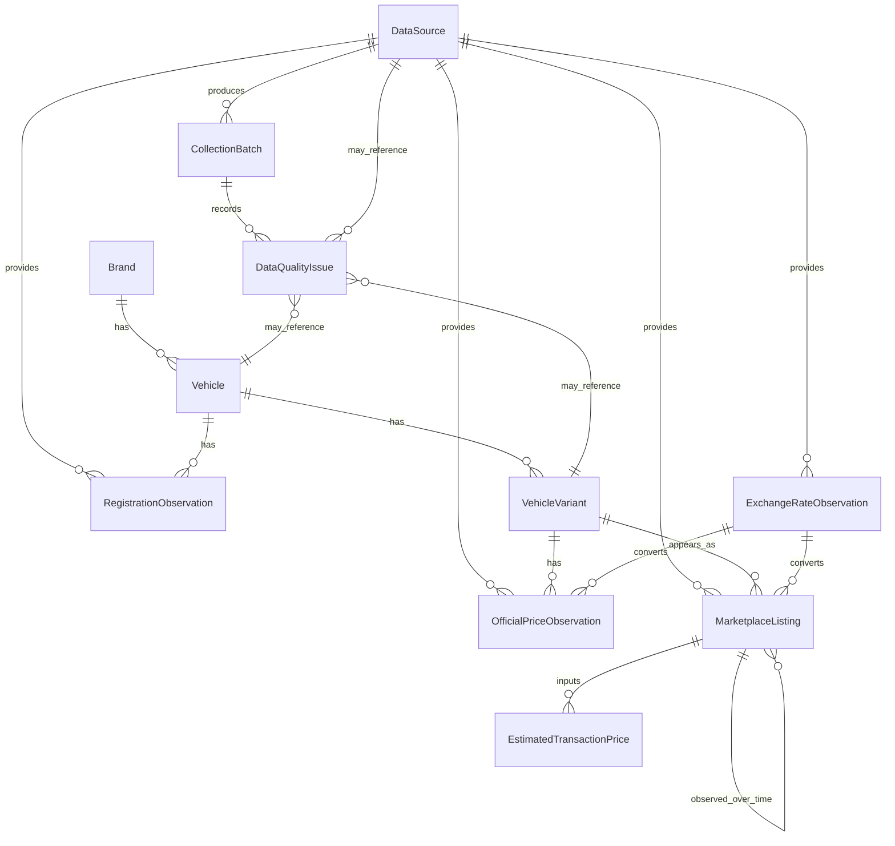

# Logical Data Model

This document describes the logical data model for Project Germania. It does
not create SQL, database tables, SQLAlchemy models, or Alembic migrations. The
model is a design reference for future implementation.

## Layer Definitions

- **Raw layer**: source-preserving data and metadata.
- **Clean layer**: normalized entities and validated observations.
- **Analytics layer**: derived estimates, metrics, forecasts, and quality
  outputs.

## Logical ER Diagram

The diagram is logical only. It does not imply final table names, keys,
foreign-key definitions, indexes, or ORM mappings.

Entity-specific identifiers such as `vehicle_id`,
`marketplace_listing_id`, and `issue_id` are logical implementation keys. They
are documented in the data dictionary but do not imply that database primary
keys have already been created.

## Entity: DataSource

- **Chinese name**: 数据源
- **Business purpose**: Defines authoritative, commercial, and supporting data
  origins.
- **Main fields**: `source_id`, `source_name`, `source_type`, `country_code`,
  `base_url`, `data_categories`, `update_frequency`, `authority_level`,
  `active`, `collection_method`, `notes`.
- **Recommended primary key**: `source_id`.
- **Recommended unique constraints**: `source_id`; optionally `source_name`.
- **Relationships**: One DataSource can produce many CollectionBatch records and
  many observations.
- **Data sources**: `config/sources.yaml`.
- **Layer**: Raw and clean reference layer.

## Entity: Brand

- **Chinese name**: 品牌
- **Business purpose**: Represents a canonical automotive brand.
- **Main fields**: `canonical_brand`, `chinese_brand`, `manufacturer`,
  `country_of_origin`, `aliases`, `active`.
- **Recommended primary key**: `brand_id` or `canonical_brand`.
- **Recommended unique constraints**: `canonical_brand`.
- **Relationships**: One Brand can have many Vehicle records.
- **Data sources**: `config/vehicles.yaml`, manufacturer metadata.
- **Layer**: Clean reference layer.

## Entity: Vehicle

- **Chinese name**: 车型
- **Business purpose**: Represents a canonical research model such as
  Volkswagen Golf or Tesla Model Y.
- **Main fields**: `canonical_brand`, `canonical_model`, `chinese_model`,
  `vehicle_segment`, `body_type`, `powertrain`, `country_of_origin`, `active`.
- **Recommended primary key**: `vehicle_id`.
- **Recommended unique constraints**: `canonical_brand`, `canonical_model`.
- **Relationships**: Belongs to one Brand; can have many VehicleVariant records;
  can have many RegistrationObservation records.
- **Data sources**: `config/vehicles.yaml`, KBA mapping, manufacturer metadata.
- **Layer**: Clean reference layer.

## Entity: VehicleVariant

- **Chinese name**: 车型版本
- **Business purpose**: Represents a model-year, trim, powertrain, body, or
  edition-specific vehicle variant.
- **Main fields**: `vehicle_id`, `model_year`, `generation`, `trim_name`,
  `variant_name`, `edition_name`, `drivetrain`, `transmission`,
  `battery_capacity_kwh`, `engine_power_kw`, `engine_power_ps`.
- **Recommended primary key**: `vehicle_variant_id`.
- **Recommended unique constraints**: `vehicle_id`, `model_year`, `trim_name`,
  `variant_name`, `edition_name`, `drivetrain`.
- **Relationships**: Belongs to one Vehicle; can have many official prices and
  many marketplace listings.
- **Data sources**: Manufacturer websites, marketplace listings, manual mapping.
- **Layer**: Clean reference layer.

## Entity: OfficialPriceObservation

- **Chinese name**: 官方价格观察
- **Business purpose**: Stores official list prices, starting prices, or
  manufacturer-recommended retail prices by date and variant.
- **Main fields**: `vehicle_variant_id`, `source_id`, `official_price`,
  `currency`, `price_eur`, `price_includes_vat`, `price_status`, `valid_date`,
  `effective_from`, `effective_to`, `source_url`, `collected_at`.
- **Recommended primary key**: `official_price_observation_id`.
- **Recommended unique constraints**: `vehicle_variant_id`, `source_id`,
  `valid_date`, `price_status`.
- **Relationships**: Belongs to one VehicleVariant and one DataSource; may
  reference an ExchangeRateObservation for non-EUR conversion.
- **Data sources**: Manufacturer Germany websites, official price lists.
- **Layer**: Clean layer.

## Entity: MarketplaceListing

- **Chinese name**: 市场挂牌
- **Business purpose**: Represents a marketplace or dealer listing and its
  historical observations.
- **Modeling note**: This is a logical entity. During database design it may be
  split into a stable listing identity plus dated listing observations if that
  makes historical price tracking clearer.
- **Main fields**: `source_id`, `source_listing_id`, `vehicle_variant_id`,
  `listed_price`, `currency`, `price_eur`, `condition`,
  `first_registration_date`, `mileage_km`, `seller_type`, `dealer_name`,
  `city`, `postal_code`, `first_seen_at`, `last_seen_at`, `observed_at`.
- **Recommended primary key**: `marketplace_listing_id`.
- **Recommended unique constraints**: `source_id`, `source_listing_id`,
  `observed_at` for history; `source_id`, `source_listing_id` for listing
  identity.
- **Relationships**: Belongs to one DataSource; may map to one VehicleVariant;
  can form multiple historical observations on different dates; can feed
  EstimatedTransactionPrice.
- **Data sources**: AutoScout24, Mobile.de, dealer imports.
- **Layer**: Raw and clean layers.

## Entity: RegistrationObservation

- **Chinese name**: 注册量观察
- **Business purpose**: Stores new vehicle registration counts and related
  sales-metric context.
- **Main fields**: `vehicle_id`, `source_id`, `registration_count`,
  `registration_period`, `registration_scope`, `sales_metric_type`,
  `sales_value`, `country_code`, `region`, `valid_date`, `source_file_name`.
- **Recommended primary key**: `registration_observation_id`.
- **Recommended unique constraints**: `vehicle_id`, `source_id`,
  `registration_period`, `registration_scope`, `sales_metric_type`.
- **Relationships**: Belongs to one Vehicle and one DataSource.
- **Data sources**: KBA as preferred source, ACEA for context.
- **Layer**: Clean and analytics input layer.

## Entity: ExchangeRateObservation

- **Chinese name**: 汇率观察
- **Business purpose**: Stores exchange rates for historical price conversion.
- **Main fields**: `source_id`, `exchange_rate`,
  `exchange_rate_base_currency`, `exchange_rate_quote_currency`,
  `exchange_rate_date`, `valid_date`, `collected_at`.
- **Recommended primary key**: `exchange_rate_observation_id`.
- **Recommended unique constraints**: `exchange_rate_date`,
  `exchange_rate_base_currency`, `exchange_rate_quote_currency`.
- **Relationships**: Can be referenced by official price and listing
  observations that require currency conversion.
- **Data sources**: ECB or another authoritative FX source.
- **Layer**: Clean reference layer.

## Entity: EstimatedTransactionPrice

- **Chinese name**: 估算成交价
- **Business purpose**: Stores model- or rule-derived transaction price
  estimates without confusing them with confirmed transaction prices.
- **Main fields**: `estimated_transaction_price`, `currency`, `price_eur`,
  `confidence_level`, `parser_version`, `observed_at`, `created_at`,
  `notes`, `input_record_reference`, `estimation_method`.
- **Recommended primary key**: `estimated_transaction_price_id`.
- **Recommended unique constraints**: `input_record_reference`,
  `estimation_method`, `observed_at`.
- **Relationships**: Must reference its input data and estimation method; often
  derived from MarketplaceListing, OfficialPriceObservation, discounts, and
  quality signals.
- **Data sources**: Derived analytics only.
- **Layer**: Analytics layer.

## Entity: CollectionBatch

- **Chinese name**: 采集批次
- **Business purpose**: Tracks manual imports, future downloads, parser runs,
  and operational metadata.
- **Main fields**: `batch_id`, `source_id`, `record_type`, `collection_job_id`,
  `raw_file_path`, `checksum`, `collected_at`, `parser_version`,
  `validation_status`, `notes`.
- **Recommended primary key**: `batch_id`.
- **Recommended unique constraints**: `source_id`, `collection_job_id`.
- **Relationships**: Belongs to one DataSource; can produce many records and
  DataQualityIssue entries.
- **Data sources**: System generated.
- **Layer**: Raw and operational layer.

## Entity: DataQualityIssue

- **Chinese name**: 数据质量问题
- **Business purpose**: Records completeness, validity, consistency,
  timeliness, duplication, and normalization issues.
- **Main fields**: `issue_id`, `source_id`, `record_id`, `record_type`,
  `data_quality_status`, `validation_status`, `rejection_reason`,
  `confidence_level`, `notes`, `created_at`.
- **Recommended primary key**: `issue_id`.
- **Recommended unique constraints**: `record_id`, `record_type`,
  `rejection_reason` when deterministic.
- **Relationships**: Can reference any data record, including DataSource,
  Vehicle, VehicleVariant, observations, batches, or derived estimates.
- **Data sources**: Validation and quality processes.
- **Layer**: Analytics and quality layer.

## Required Relationship Rules

- One Brand can have many Vehicle records.
- One Vehicle can have many VehicleVariant records.
- One VehicleVariant can have many official price records.
- One VehicleVariant can correspond to many marketplace listing records.
- One Vehicle can have many registration observations.
- One exchange-rate date and currency pair can have one exchange-rate record.
- One marketplace listing can create historical observations on different dates.
- Estimated transaction prices must reference their input data and estimation
  method.
- DataQualityIssue can associate with any data record.
