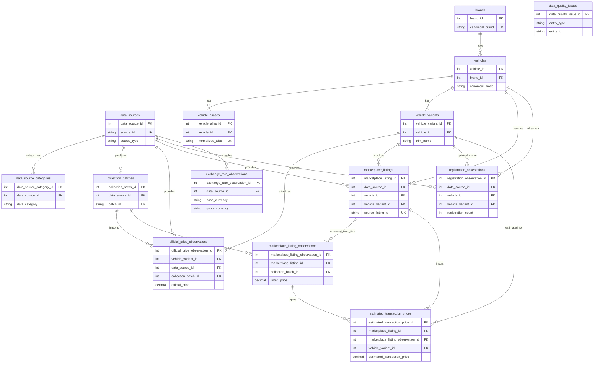

# Project Germania Database ER Design

Phase 4 design date: 2026-07-18

This file is a physical relational database design for Project Germania. The
database has not been created. SQLAlchemy models have not been created. Alembic
migrations have not been created. All table names, column names, constraints,
and indexes in this document are design specifications only. Future
implementation must trace every stored or derived field back to
`docs/data_dictionary.md`.

The initial database target is SQLite for local development while preserving a
clear migration path to PostgreSQL. This document does not execute DDL, does
not create SQLite or PostgreSQL files, and does not include `CREATE TABLE`
statements.

## 1. Design Scope

Phase 4 converts the logical model into an implementable relational design:

- physical table list;
- table field definitions;
- primary-key design;
- foreign-key design and delete/update behavior;
- unique constraints;
- CHECK constraints;
- index recommendations;
- table relationships;
- data dictionary field mapping;
- SQLite and PostgreSQL compatibility notes;
- database ER Mermaid diagram;
- design review checklist.

Out of scope:

- real database creation;
- SQL files;
- SQLAlchemy model classes;
- Alembic migrations;
- data collection;
- Playwright;
- real website or API connections;
- dashboard implementation;
- real or fabricated market data.

## 2. Database Layers

| Layer | Tables | Responsibility |
| --- | --- | --- |
| Reference / Master Data | `data_sources`, `data_source_categories`, `brands`, `vehicles`, `vehicle_aliases`, `vehicle_variants` | Stable definitions for sources, brands, models, aliases, and variants. |
| Raw / Source Tracking | `collection_batches` plus source trace columns in observation tables | Track manual imports, future jobs, source files, parser versions, and checksums. |
| Observation / Historical Data | `official_price_observations`, `marketplace_listings`, `marketplace_listing_observations`, `registration_observations`, `exchange_rate_observations` | Store time-varying official prices, listing observations, registrations, and FX rates. |
| Analytical / Derived Data | `estimated_transaction_prices` | Store derived transaction-price estimates without presenting them as confirmed transactions. |
| Data Quality | `data_quality_issues` plus quality status columns in observations | Store validation, rejection, conflict, and review issues. |

The design deliberately avoids a single wide `cars` table because sources,
vehicles, observations, prices, registrations, and quality issues have different
lifecycles and different uniqueness rules.

## 3. Physical Table List

Core tables:

1. `data_sources`
2. `brands`
3. `vehicles`
4. `vehicle_variants`
5. `collection_batches`
6. `official_price_observations`
7. `marketplace_listings`
8. `marketplace_listing_observations`
9. `registration_observations`
10. `exchange_rate_observations`
11. `estimated_transaction_prices`
12. `data_quality_issues`

Auxiliary tables:

13. `data_source_categories`
14. `vehicle_aliases`

Auxiliary table rationale:

- `data_source_categories` normalizes the multi-value `data_categories` field
  from `config/sources.yaml`. It avoids comma-separated strings and remains
  compatible with SQLite and PostgreSQL.
- `vehicle_aliases` normalizes aliases from `config/vehicles.yaml`. It prevents
  the same normalized alias from pointing to multiple vehicles and keeps
  matching logic auditable.

## 4. Type Conventions

| Logical type | SQLite design | PostgreSQL design | Notes |
| --- | --- | --- | --- |
| Primary key | `INTEGER` identity semantics | `BIGINT` identity semantics | No ID generation is implemented in this phase. |
| Text | `TEXT` | `TEXT` or bounded `VARCHAR` where useful | Keep snake_case column names. |
| Enum | `TEXT` with CHECK plus application validation | `TEXT` with CHECK initially; native ENUM optional later | CHECK keeps migration simpler. |
| Decimal money / rates | NUMERIC semantics | `NUMERIC(p, s)` | Python should use Decimal, not float. |
| Boolean | Boolean semantics with CHECK where needed | `BOOLEAN` | SQLite stores boolean-like values dynamically; CHECK is recommended. |
| Date | ISO date string semantics | `DATE` | Use `_date` suffix. |
| Timestamp | ISO 8601 UTC text semantics | `TIMESTAMPTZ` | Store UTC; display may use Europe/Berlin. |
| JSON / arrays | Avoid for core portable design | JSONB or arrays may be considered later | Use association tables for current multi-value fields. |

## 5. Primary-Key Strategy

Two options were considered:

| Option | Advantages | Disadvantages |
| --- | --- | --- |
| Integer identity keys | Simple in SQLite, fast joins, easy fixtures, compact indexes. | IDs are local to one database unless paired with business keys. |
| UUID keys | Better for distributed merges and cross-environment movement. | Verbose, slightly harder local debugging, extra generation rules. |

Recommended initial approach: use integer identity-style surrogate keys for all
physical primary keys, and enforce stable business keys with unique constraints
such as `source_id`, `canonical_brand`, and `(brand_id, canonical_model)`.

This balances local SQLite development, PostgreSQL migration, batch import
tests, and future environment merges. UUIDs may be added later if distributed
sync becomes a concrete requirement.

## 6. Table Definitions

### 6.1 `data_sources`

Purpose: store planned source definitions from `config/sources.yaml`.

| Column | Type | Nullable | Notes |
| --- | --- | --- | --- |
| `data_source_id` | integer identity | No | Primary key. |
| `source_id` | text | No | Stable business key from config. |
| `source_name` | text | No | Human-readable source name. |
| `source_type` | enum text | No | `government`, `industry_association`, `central_bank`, `manufacturer`, `marketplace`. |
| `country_code` | text | No | Two uppercase letters such as `DE` or project-level `EU`. |
| `base_url` | text | Yes | Public base URL only; no scrape path or secret. |
| `update_frequency` | enum text | No | `daily`, `weekly`, `monthly`, `quarterly`, `irregular`, `manual`. |
| `authority_level` | enum text | No | `primary_authoritative`, `primary_commercial`, `secondary_authoritative`, `secondary_commercial`. |
| `active` | boolean | No | Prefer disabling over deleting. |
| `collection_method` | enum text | No | `manual_download`, `api`, `html_parse`, `browser_automation`, `manual_entry`. |
| `notes` | text | No | Planning status, expected use, restrictions. |
| `created_at` | timestamp UTC | No | System timestamp. |
| `updated_at` | timestamp UTC | No | System timestamp. |

Primary key: `data_source_id`  
Unique constraints: `source_id`  
Delete behavior: data sources should be disabled with `active = false`; physical
delete should be restricted while dependent records exist.

### 6.2 `data_source_categories`

Purpose: normalize multi-value source data categories.

| Column | Type | Nullable | Notes |
| --- | --- | --- | --- |
| `data_source_category_id` | integer identity | No | Primary key. |
| `data_source_id` | integer | No | FK to `data_sources`. |
| `data_category` | enum text | No | `registrations`, `official_prices`, `listings`, `exchange_rates`, `market_statistics`, `vehicle_specifications`. |

Primary key: `data_source_category_id`  
Unique constraints: `(data_source_id, data_category)`  
Delete behavior: cascade is acceptable only from `data_sources` to this pure
association table, but production deletes of `data_sources` should still be
rare and controlled.

### 6.3 `brands`

Purpose: store canonical brands.

| Column | Type | Nullable | Notes |
| --- | --- | --- | --- |
| `brand_id` | integer identity | No | Primary key. |
| `canonical_brand` | text | No | Standard brand name. |
| `chinese_brand` | text | Yes | Chinese display name. |
| `manufacturer` | text | Yes | Manufacturer or group name. |
| `country_of_origin` | text | Yes | Project-standard country text. |
| `active` | boolean | No | Soft-disable flag. |
| `created_at` | timestamp UTC | No | System timestamp. |
| `updated_at` | timestamp UTC | No | System timestamp. |

Primary key: `brand_id`  
Unique constraints: `canonical_brand`  
Raw source brand text is not stored here; it belongs in observation or listing
records.

### 6.4 `vehicles`

Purpose: store canonical research vehicles.

| Column | Type | Nullable | Notes |
| --- | --- | --- | --- |
| `vehicle_id` | integer identity | No | Primary key. |
| `brand_id` | integer | No | FK to `brands`. |
| `canonical_model` | text | No | Standard model name. |
| `chinese_model` | text | Yes | Chinese display name. |
| `vehicle_segment` | text | Yes | Project-controlled segment value. |
| `body_type` | text | Yes | Project-controlled body style. |
| `default_powertrain` | enum text | Yes | Default normalized powertrain for the canonical model. |
| `priority_level` | enum text | No | `high`, `medium`, `low`. |
| `active` | boolean | No | Soft-disable flag. |
| `created_at` | timestamp UTC | No | System timestamp. |
| `updated_at` | timestamp UTC | No | System timestamp. |

Primary key: `vehicle_id`  
Foreign key: `brand_id` -> `brands.brand_id`  
Unique constraints: `(brand_id, canonical_model)`  
Close models must not be merged: Volkswagen `ID.4` is not `ID.5`; BYD `Seal U`
is not `Seal`; BMW `iX1` is not BMW `X1`.

### 6.5 `vehicle_aliases`

Purpose: store exact aliases used for safe vehicle matching.

| Column | Type | Nullable | Notes |
| --- | --- | --- | --- |
| `vehicle_alias_id` | integer identity | No | Primary key. |
| `vehicle_id` | integer | No | FK to `vehicles`. |
| `alias_text` | text | No | Original alias from configuration or verified mapping. |
| `normalized_alias` | text | No | Normalized key used for exact matching. |
| `alias_language` | text | Yes | Suggested values: `english`, `german`, `chinese`, `unknown`. |
| `alias_type` | enum text | No | `official`, `german`, `english`, `marketplace`, `common`. |
| `created_at` | timestamp UTC | No | System timestamp. |

Primary key: `vehicle_alias_id`  
Foreign key: `vehicle_id` -> `vehicles.vehicle_id`  
Unique constraints: `normalized_alias`  
The same `normalized_alias` must not point to different vehicles. The design
uses exact aliases and does not add fuzzy matching.

### 6.6 `vehicle_variants`

Purpose: store model-year, trim, edition, powertrain, and specification variants.

| Column | Type | Nullable | Notes |
| --- | --- | --- | --- |
| `vehicle_variant_id` | integer identity | No | Primary key. |
| `vehicle_id` | integer | No | FK to `vehicles`. |
| `model_year` | integer / text | Yes | Model year, not first registration year. |
| `generation` | text | Yes | Generation label when verified. |
| `trim_name` | text | Yes | Official or source-displayed trim. |
| `variant_name` | text | Yes | Powertrain/body/battery variant name. |
| `edition_name` | text | Yes | Special or limited edition. |
| `drivetrain` | text | Yes | `fwd`, `rwd`, `awd`, or verified source value. |
| `transmission` | text | Yes | Transmission label. |
| `powertrain` | enum text | Yes | Normalized powertrain. |
| `fuel_type` | text | Yes | More granular fuel type. |
| `battery_capacity_kwh` | numeric | Yes | Decimal semantics; non-negative. |
| `engine_power_kw` | numeric | Yes | Decimal semantics; non-negative. |
| `engine_power_ps` | numeric | Yes | Decimal semantics; non-negative. |
| `effective_from` | date / timestamp | Yes | Variant validity start. |
| `effective_to` | date / timestamp | Yes | Variant validity end. |
| `active` | boolean | No | Soft-disable flag. |
| `created_at` | timestamp UTC | No | System timestamp. |
| `updated_at` | timestamp UTC | No | System timestamp. |

Primary key: `vehicle_variant_id`  
Foreign key: `vehicle_id` -> `vehicles.vehicle_id`  
Recommended business uniqueness: `(vehicle_id, model_year, trim_name,
variant_name, edition_name, drivetrain)`.

Nullable uniqueness note: SQLite and PostgreSQL allow multiple NULLs in UNIQUE
constraints. For portable behavior, use application validation and, later, an
implementation-specific expression or generated normalized key such as
`variant_identity_key` built from explicit placeholder values. This phase does
not add that generated column to the physical design because no database is
implemented yet.

### 6.7 `collection_batches`

Purpose: track one manual import, file processing run, API task, or future
collection job.

| Column | Type | Nullable | Notes |
| --- | --- | --- | --- |
| `collection_batch_id` | integer identity | No | Primary key. |
| `data_source_id` | integer | No | FK to `data_sources`. |
| `batch_id` | text | No | Stable batch identifier. |
| `record_type` | enum text | Yes | Target record category. |
| `collection_method` | enum text | No | Planned or actual method. |
| `collection_job_id` | text | Yes | Operational job identifier. |
| `started_at` | timestamp UTC | Yes | Job start time. |
| `completed_at` | timestamp UTC | Yes | Job completion time. |
| `status` | enum text | No | `pending`, `running`, `completed`, `partially_completed`, `failed`, `cancelled`. |
| `record_count` | integer | Yes | Total records seen. |
| `success_count` | integer | Yes | Successfully processed records. |
| `failure_count` | integer | Yes | Failed records. |
| `source_file_name` | text | Yes | Original import file name. |
| `raw_file_path` | text | Yes | Immutable raw file path when available. |
| `raw_payload_reference` | text | Yes | Raw payload reference. |
| `parser_version` | text | Yes | Parser version or commit. |
| `checksum` | text | Yes | Raw file checksum. |
| `notes` | text | Yes | Operational caveats. |
| `created_at` | timestamp UTC | No | System timestamp. |

Primary key: `collection_batch_id`  
Foreign key: `data_source_id` -> `data_sources.data_source_id`  
Unique constraints: `batch_id`  
This table is only a design for tracking future imports or jobs; it does not
mean a collector exists.

### 6.8 `official_price_observations`

Purpose: store official manufacturer price history.

| Column | Type | Nullable | Notes |
| --- | --- | --- | --- |
| `official_price_observation_id` | integer identity | No | Primary key. |
| `vehicle_variant_id` | integer | No | FK to `vehicle_variants`. |
| `data_source_id` | integer | No | FK to `data_sources`. |
| `collection_batch_id` | integer | Yes | FK to `collection_batches`. |
| `official_price` | numeric | No | Decimal semantics; non-negative. |
| `currency` | text | No | ISO 4217 three-letter code. |
| `price_includes_vat` | boolean | Yes | VAT inclusion if known. |
| `valid_date` | date | No | Business-effective date. |
| `effective_from` | date / timestamp | Yes | Validity window start. |
| `effective_to` | date / timestamp | Yes | Validity window end. |
| `observed_at` | timestamp UTC | Yes | Source observation time. |
| `collected_at` | timestamp UTC | Yes | System collection time. |
| `source_url` | text | Yes | Exact source page or file URL. |
| `source_record_id` | text | Yes | Source row or record ID. |
| `raw_brand` | text | Yes | Raw source brand text. |
| `raw_model` | text | Yes | Raw source model text. |
| `raw_variant_name` | text | Yes | Raw source variant text. |
| `data_quality_status` | enum text | Yes | `valid`, `warning`, `invalid`, `unknown`. |
| `validation_status` | enum text | Yes | `pending`, `passed`, `failed`. |
| `notes` | text | Yes | Caveats or manual review notes. |
| `created_at` | timestamp UTC | No | System timestamp. |
| `updated_at` | timestamp UTC | No | System timestamp. |

Primary key: `official_price_observation_id`  
Foreign keys: `vehicle_variant_id`, `data_source_id`, `collection_batch_id`  
Recommended unique constraint: `(vehicle_variant_id, data_source_id,
valid_date, official_price)`  
This table does not store `listed_price` or `transaction_price`.

### 6.9 `marketplace_listings`

Purpose: store stable listing identities from AutoScout24, Mobile.de, dealers,
or future compliant imports.

| Column | Type | Nullable | Notes |
| --- | --- | --- | --- |
| `marketplace_listing_id` | integer identity | No | Primary key. |
| `data_source_id` | integer | No | FK to `data_sources`. |
| `source_listing_id` | text | No | Listing ID from source platform. |
| `vehicle_id` | integer | Yes | FK to `vehicles`; nullable when unmatched. |
| `vehicle_variant_id` | integer | Yes | FK to `vehicle_variants`; nullable when variant is unknown. |
| `raw_brand` | text | Yes | Raw source brand text. |
| `raw_model` | text | Yes | Raw source model text. |
| `raw_variant_name` | text | Yes | Raw source trim/variant text. |
| `model_year` | integer / text | Yes | Model year when available. |
| `first_registration_date` | date | Yes | First registration date, not model year. |
| `condition` | enum text | Yes | `new`, `used`, `demonstrator`, `unknown`. |
| `mileage_km` | integer | Yes | Non-negative. |
| `owner_count` | integer | Yes | Non-negative. |
| `seller_type` | enum text | Yes | `manufacturer`, `dealer`, `private`, `marketplace`, `unknown`. |
| `dealer_name` | text | Yes | Dealer display name. |
| `country_code` | text | Yes | Two uppercase letters when known. |
| `state` | text | Yes | German federal state or source region. |
| `city` | text | Yes | Listing city. |
| `postal_code` | text | Yes | Keep as text to preserve leading zeros. |
| `source_url` | text | Yes | Listing page URL. |
| `first_seen_at` | timestamp UTC | Yes | First project observation time. |
| `last_seen_at` | timestamp UTC | Yes | Last project observation time. |
| `active` | boolean | No | Current active flag. |
| `notes` | text | Yes | Caveats or review notes. |
| `created_at` | timestamp UTC | No | System timestamp. |
| `updated_at` | timestamp UTC | No | System timestamp. |

Primary key: `marketplace_listing_id`  
Foreign keys: `data_source_id`, `vehicle_id`, `vehicle_variant_id`  
Unique constraints: `(data_source_id, source_listing_id)`  
The listing table does not store continuously changing price history; that
belongs in `marketplace_listing_observations`.

### 6.10 `marketplace_listing_observations`

Purpose: store price and status changes for the same listing over time.

| Column | Type | Nullable | Notes |
| --- | --- | --- | --- |
| `marketplace_listing_observation_id` | integer identity | No | Primary key. |
| `marketplace_listing_id` | integer | No | FK to `marketplace_listings`. |
| `collection_batch_id` | integer | Yes | FK to `collection_batches`. |
| `listed_price` | numeric | Yes | Decimal semantics; non-negative when present. |
| `currency` | text | Yes | ISO 4217 three-letter code when price exists. |
| `price_includes_vat` | boolean | Yes | VAT inclusion if known. |
| `observed_at` | timestamp UTC | No | Observation timestamp. |
| `collected_at` | timestamp UTC | Yes | System collection timestamp. |
| `listing_status` | enum text | No | `active`, `removed`, `sold`, `unavailable`, `unknown`. |
| `mileage_km` | integer | Yes | Non-negative; observed value may change. |
| `source_url` | text | Yes | Exact source URL when observed. |
| `data_quality_status` | enum text | Yes | `valid`, `warning`, `invalid`, `unknown`. |
| `validation_status` | enum text | Yes | `pending`, `passed`, `failed`. |
| `duplicate_key` | text | Yes | Deterministic dedupe key. |
| `notes` | text | Yes | Observation caveats. |
| `created_at` | timestamp UTC | No | System timestamp. |

Primary key: `marketplace_listing_observation_id`  
Foreign keys: `marketplace_listing_id`, `collection_batch_id`  
Unique constraints: `(marketplace_listing_id, observed_at)`  
`listed_price` is an asking price and must not be treated as a real transaction
price. Price history must be appended, not overwritten.

### 6.11 `registration_observations`

Purpose: store KBA or ACEA registration counts and other explicitly labeled
sales metrics.

| Column | Type | Nullable | Notes |
| --- | --- | --- | --- |
| `registration_observation_id` | integer identity | No | Primary key. |
| `data_source_id` | integer | No | FK to `data_sources`. |
| `vehicle_id` | integer | Yes | FK to `vehicles`; nullable for brand-level or unmatched data. |
| `vehicle_variant_id` | integer | Yes | FK to `vehicle_variants`; usually nullable. |
| `canonical_brand` | text | Yes | Standard brand when resolved. |
| `canonical_model` | text | Yes | Standard model when resolved. |
| `raw_brand` | text | Yes | Raw source brand text. |
| `raw_model` | text | Yes | Raw source model text. |
| `registration_count` | integer | Yes | Non-negative KBA-style new registrations. |
| `sales_value` | numeric | Yes | Other non-negative sales metric. |
| `sales_metric_type` | enum text | No | `new_registration`, `retail_sales`, `wholesale_sales`, `delivery`, `unknown`. |
| `registration_period` | text | No | Period such as `YYYY-MM`, `YYYY-Qn`, or `YYYY`. |
| `registration_scope` | text | No | `Germany`, German state, or `EU`. |
| `region` | text | Yes | Analysis region. |
| `country_code` | text | Yes | Two uppercase letters or project-level `EU`. |
| `state` | text | Yes | German federal state when applicable. |
| `valid_date` | date | Yes | Source business date. |
| `observed_at` | timestamp UTC | Yes | Source observation time. |
| `collected_at` | timestamp UTC | Yes | System collection time. |
| `source_url` | text | Yes | Exact source URL. |
| `source_record_id` | text | Yes | Source row or record ID. |
| `source_file_name` | text | Yes | Source file name. |
| `source_page_number` | integer | Yes | Positive page number when available. |
| `data_quality_status` | enum text | Yes | `valid`, `warning`, `invalid`, `unknown`. |
| `validation_status` | enum text | Yes | `pending`, `passed`, `failed`. |
| `notes` | text | Yes | Metric caveats and mapping notes. |
| `created_at` | timestamp UTC | No | System timestamp. |
| `updated_at` | timestamp UTC | No | System timestamp. |

Primary key: `registration_observation_id`  
Foreign keys: `data_source_id`, `vehicle_id`, `vehicle_variant_id`  
Recommended uniqueness:

- resolved records: `(data_source_id, vehicle_id, registration_period,
  registration_scope, sales_metric_type)`;
- unresolved records: `(data_source_id, raw_brand, raw_model,
  registration_period, registration_scope, sales_metric_type)`.

Nullable uniqueness note: SQLite and PostgreSQL handle NULLs differently from
business expectations. Use application validation first; later PostgreSQL may
use partial unique indexes and SQLite may use expression indexes with explicit
coalescing.

### 6.12 `exchange_rate_observations`

Purpose: store authoritative exchange rates and rate direction.

| Column | Type | Nullable | Notes |
| --- | --- | --- | --- |
| `exchange_rate_observation_id` | integer identity | No | Primary key. |
| `data_source_id` | integer | No | FK to `data_sources`. |
| `base_currency` | text | No | ISO 4217 three-letter code. |
| `quote_currency` | text | No | ISO 4217 three-letter code. |
| `exchange_rate` | numeric | No | Decimal semantics; must be greater than 0. |
| `exchange_rate_date` | date | No | Rate date. |
| `observed_at` | timestamp UTC | Yes | Source observation timestamp. |
| `collected_at` | timestamp UTC | Yes | System collection timestamp. |
| `source_url` | text | Yes | Source URL or API endpoint description. |
| `data_quality_status` | enum text | Yes | `valid`, `warning`, `invalid`, `unknown`. |
| `validation_status` | enum text | Yes | `pending`, `passed`, `failed`. |
| `notes` | text | Yes | Rate caveats. |
| `created_at` | timestamp UTC | No | System timestamp. |

Primary key: `exchange_rate_observation_id`  
Foreign key: `data_source_id` -> `data_sources.data_source_id`  
Unique constraints: `(data_source_id, base_currency, quote_currency,
exchange_rate_date)`  
`price_eur` is not stored in this table; it belongs to price records or query
outputs if materialized later.

### 6.13 `estimated_transaction_prices`

Purpose: store estimated transaction prices without confusing them with
confirmed transaction prices.

| Column | Type | Nullable | Notes |
| --- | --- | --- | --- |
| `estimated_transaction_price_id` | integer identity | No | Primary key. |
| `marketplace_listing_id` | integer | Yes | FK to `marketplace_listings`. |
| `marketplace_listing_observation_id` | integer | Yes | FK to `marketplace_listing_observations`. |
| `vehicle_variant_id` | integer | Yes | FK to `vehicle_variants`. |
| `estimated_transaction_price` | numeric | No | Decimal semantics; non-negative. |
| `currency` | text | No | ISO 4217 three-letter code. |
| `estimation_method` | text | No | Rule or model method name. |
| `estimation_version` | text | No | Rule/model version. |
| `confidence_level` | enum text | No | `high`, `medium`, `low`, `unknown`. |
| `input_reference` | text | No | Traceable input data reference. |
| `estimated_at` | timestamp UTC | No | When the estimate was generated. |
| `valid_date` | date | Yes | Business date the estimate represents. |
| `notes` | text | Yes | Estimate caveats. |
| `created_at` | timestamp UTC | No | System timestamp. |

Primary key: `estimated_transaction_price_id`  
Foreign keys: `marketplace_listing_id`,
`marketplace_listing_observation_id`, `vehicle_variant_id`  
Recommended unique constraints: `(input_reference, estimation_method,
estimation_version, estimated_at)`  
This table must not be named `transactions`, and it must not store fabricated
confirmed transaction prices.

### 6.14 `data_quality_issues`

Purpose: record quality issues against any data record.

| Column | Type | Nullable | Notes |
| --- | --- | --- | --- |
| `data_quality_issue_id` | integer identity | No | Primary key. |
| `entity_type` | text | No | Target table/entity name. |
| `entity_id` | text | No | Target record identifier as text. |
| `issue_code` | text | No | Structured issue code. |
| `severity` | enum text | No | `critical`, `high`, `medium`, `low`, `informational`. |
| `description` | text | No | Human-readable issue description. |
| `resolution_status` | enum text | No | `open`, `investigating`, `resolved`, `accepted`, `ignored`. |
| `detected_at` | timestamp UTC | No | Detection time. |
| `resolved_at` | timestamp UTC | Yes | Resolution time. |
| `resolution_notes` | text | Yes | Resolution comments. |
| `created_at` | timestamp UTC | No | System timestamp. |
| `updated_at` | timestamp UTC | No | System timestamp. |

Primary key: `data_quality_issue_id`  
Generic relationship: `(entity_type, entity_id)` may point to any table. This
cannot be enforced as a single relational foreign key. The tradeoff is accepted
for Phase 4 to avoid a large set of per-entity issue link tables.

## 7. Foreign-Key Design

| Child table | Column | Parent table | ON DELETE | ON UPDATE | Rationale |
| --- | --- | --- | --- | --- | --- |
| `data_source_categories` | `data_source_id` | `data_sources` | CASCADE | CASCADE | Pure association rows should follow the parent if a controlled delete occurs. |
| `vehicles` | `brand_id` | `brands` | RESTRICT | CASCADE | Do not lose vehicles when a brand exists in observations. |
| `vehicle_aliases` | `vehicle_id` | `vehicles` | CASCADE | CASCADE | Alias rows are dependent reference data. |
| `vehicle_variants` | `vehicle_id` | `vehicles` | RESTRICT | CASCADE | Variants should survive through soft-disable, not physical deletion. |
| `collection_batches` | `data_source_id` | `data_sources` | RESTRICT | CASCADE | A source with batch history should not be physically removed. |
| `official_price_observations` | `vehicle_variant_id` | `vehicle_variants` | RESTRICT | CASCADE | Historical prices must not be lost. |
| `official_price_observations` | `data_source_id` | `data_sources` | RESTRICT | CASCADE | Source traceability must remain. |
| `official_price_observations` | `collection_batch_id` | `collection_batches` | SET NULL | CASCADE | Price records may remain if a batch record is administratively removed. |
| `marketplace_listings` | `data_source_id` | `data_sources` | RESTRICT | CASCADE | Listing source traceability must remain. |
| `marketplace_listings` | `vehicle_id` | `vehicles` | SET NULL | CASCADE | Preserve unmatched listing record if mapping changes. |
| `marketplace_listings` | `vehicle_variant_id` | `vehicle_variants` | SET NULL | CASCADE | Preserve listing if variant mapping is withdrawn. |
| `marketplace_listing_observations` | `marketplace_listing_id` | `marketplace_listings` | RESTRICT | CASCADE | Price history should not be deleted accidentally. |
| `marketplace_listing_observations` | `collection_batch_id` | `collection_batches` | SET NULL | CASCADE | Observation can remain without batch row. |
| `registration_observations` | `data_source_id` | `data_sources` | RESTRICT | CASCADE | Source traceability must remain. |
| `registration_observations` | `vehicle_id` | `vehicles` | SET NULL | CASCADE | Keep registration record if model mapping is withdrawn. |
| `registration_observations` | `vehicle_variant_id` | `vehicle_variants` | SET NULL | CASCADE | Variant-level mapping is optional. |
| `exchange_rate_observations` | `data_source_id` | `data_sources` | RESTRICT | CASCADE | FX source traceability must remain. |
| `estimated_transaction_prices` | `marketplace_listing_id` | `marketplace_listings` | SET NULL | CASCADE | Keep estimates auditable even if mapping is withdrawn. |
| `estimated_transaction_prices` | `marketplace_listing_observation_id` | `marketplace_listing_observations` | SET NULL | CASCADE | Keep estimate with `input_reference`. |
| `estimated_transaction_prices` | `vehicle_variant_id` | `vehicle_variants` | SET NULL | CASCADE | Keep derived estimate if variant mapping changes. |

General policy: do not apply blanket CASCADE. Master data should normally be
soft-disabled with `active`, while historical observations should be preserved.

## 8. Unique Constraints

| ID | Table | Columns | Notes |
| --- | --- | --- | --- |
| UQ-001 | `data_sources` | `source_id` | Stable configured source key. |
| UQ-002 | `data_source_categories` | `data_source_id`, `data_category` | Prevent duplicate category rows. |
| UQ-003 | `brands` | `canonical_brand` | One canonical brand record. |
| UQ-004 | `vehicles` | `brand_id`, `canonical_model` | One canonical model per brand. |
| UQ-005 | `vehicle_aliases` | `normalized_alias` | Prevent aliases from pointing to multiple vehicles. |
| UQ-006 | `vehicle_variants` | `vehicle_id`, `model_year`, `trim_name`, `variant_name`, `edition_name`, `drivetrain` | Requires nullable-field handling in implementation. |
| UQ-007 | `collection_batches` | `batch_id` | Stable import/job identifier. |
| UQ-008 | `official_price_observations` | `vehicle_variant_id`, `data_source_id`, `valid_date`, `official_price` | Prevent duplicate official price rows for the same valid date. |
| UQ-009 | `marketplace_listings` | `data_source_id`, `source_listing_id` | Stable source listing identity. |
| UQ-010 | `marketplace_listing_observations` | `marketplace_listing_id`, `observed_at` | One observation per listing timestamp. |
| UQ-011 | `registration_observations` | `data_source_id`, `vehicle_id`, `registration_period`, `registration_scope`, `sales_metric_type` | Applies when `vehicle_id` is present. |
| UQ-012 | `exchange_rate_observations` | `data_source_id`, `base_currency`, `quote_currency`, `exchange_rate_date` | One rate per source, pair, and date. |
| UQ-013 | `estimated_transaction_prices` | `input_reference`, `estimation_method`, `estimation_version`, `estimated_at` | Prevent duplicate derived estimates. |

For `vehicle_variants` and unresolved `registration_observations`, NULL values
can weaken UNIQUE behavior. The implementation phase should combine application
validation with either PostgreSQL partial unique indexes or portable expression
indexes using explicit placeholder values.

## 9. CHECK Constraints

| ID | Table | Rule | Notes |
| --- | --- | --- | --- |
| CK-001 | `data_sources` | `source_type` in allowed values | Source enum. |
| CK-002 | `data_sources` | `update_frequency` in allowed values | Frequency enum. |
| CK-003 | `data_sources` | `authority_level` in allowed values | Authority enum. |
| CK-004 | `data_sources` | `collection_method` in allowed values | Method enum. |
| CK-005 | `data_sources` | length of `country_code` is 2 | Project rule accepts `DE` and `EU`. |
| CK-006 | `data_sources` | `active` is boolean-like | Needed for SQLite portability. |
| CK-007 | `data_source_categories` | `data_category` in allowed values | Category enum. |
| CK-008 | `vehicles` | `priority_level` in `high`, `medium`, `low` | Matches config validation. |
| CK-009 | `vehicles` | `active` is boolean-like | Soft-disable flag. |
| CK-010 | `vehicle_aliases` | `alias_text` is not empty | Avoid unsafe aliases. |
| CK-011 | `vehicle_aliases` | `alias_type` in allowed values | Alias enum. |
| CK-012 | `vehicle_variants` | numeric specs are non-negative | Battery and power fields. |
| CK-013 | `vehicle_variants` | `effective_to >= effective_from` when both exist | Validity window. |
| CK-014 | `vehicle_variants` | `active` is boolean-like | Soft-disable flag. |
| CK-015 | `collection_batches` | counts are non-negative | `record_count`, `success_count`, `failure_count`. |
| CK-016 | `collection_batches` | `success_count + failure_count <= record_count` when all exist | Batch consistency. |
| CK-017 | `collection_batches` | `completed_at >= started_at` when both exist | Time consistency. |
| CK-018 | `collection_batches` | `status` in allowed values | Batch status enum. |
| CK-019 | `official_price_observations` | `official_price >= 0` | Decimal money rule. |
| CK-020 | `official_price_observations` | length of `currency` is 3 | ISO 4217 shape. |
| CK-021 | `official_price_observations` | `effective_to >= effective_from` when both exist | Validity window. |
| CK-022 | `marketplace_listings` | `mileage_km >= 0` and `owner_count >= 0` | Listing facts. |
| CK-023 | `marketplace_listings` | `last_seen_at >= first_seen_at` when both exist | Lifecycle consistency. |
| CK-024 | `marketplace_listings` | `condition` and `seller_type` in allowed values | Listing enums. |
| CK-025 | `marketplace_listings` | `active` is boolean-like | Current listing state. |
| CK-026 | `marketplace_listing_observations` | `listed_price >= 0` when present | Asking price rule. |
| CK-027 | `marketplace_listing_observations` | `mileage_km >= 0` when present | Observed mileage. |
| CK-028 | `marketplace_listing_observations` | length of `currency` is 3 when present | ISO 4217 shape. |
| CK-029 | `marketplace_listing_observations` | `listing_status` in allowed values | Observation status enum. |
| CK-030 | `registration_observations` | `registration_count >= 0` when present | Registration rule. |
| CK-031 | `registration_observations` | `sales_value >= 0` when present | Sales metric rule. |
| CK-032 | `registration_observations` | `sales_metric_type` in allowed values | Sales metric enum. |
| CK-033 | `registration_observations` | length of `country_code` is 2 when present | Country code shape. |
| CK-034 | `exchange_rate_observations` | length of currencies is 3 | ISO 4217 shape. |
| CK-035 | `exchange_rate_observations` | `exchange_rate > 0` | FX rate rule. |
| CK-036 | `exchange_rate_observations` | `base_currency <> quote_currency` unless explicitly allowed by policy | Avoid ambiguous self-conversion. |
| CK-037 | `estimated_transaction_prices` | `estimated_transaction_price >= 0` | Estimated amount rule. |
| CK-038 | `estimated_transaction_prices` | length of `currency` is 3 | ISO 4217 shape. |
| CK-039 | `estimated_transaction_prices` | `confidence_level` in allowed values | Estimate confidence enum. |
| CK-040 | `data_quality_issues` | `severity` in allowed values | Quality severity enum. |
| CK-041 | `data_quality_issues` | `resolution_status` in allowed values | Resolution enum. |
| CK-042 | `data_quality_issues` | `resolved_at >= detected_at` when both exist | Quality lifecycle rule. |

SQLite and PostgreSQL both support CHECK constraints, but enforcement details
and type affinity differ. The implementation phase should test every CHECK on
both backends.

## 10. Index Recommendations

| ID | Table | Index columns | Type | Supports |
| --- | --- | --- | --- | --- |
| IDX-001 | `vehicles` | `brand_id`, `canonical_model` | unique / lookup | Canonical vehicle lookup by brand and model. |
| IDX-002 | `vehicles` | `canonical_model` | normal | Model-name search after brand filtering is unavailable. |
| IDX-003 | `vehicle_aliases` | `normalized_alias` | unique | Exact alias matching. |
| IDX-004 | `vehicle_variants` | `vehicle_id`, `model_year` | normal | Variant lookup by vehicle and year. |
| IDX-005 | `official_price_observations` | `vehicle_variant_id`, `valid_date` | normal | Price history by variant. |
| IDX-006 | `official_price_observations` | `data_source_id`, `valid_date` | normal | Source/date audit queries. |
| IDX-007 | `marketplace_listings` | `data_source_id`, `source_listing_id` | unique | Source listing lookup. |
| IDX-008 | `marketplace_listings` | `vehicle_id`, `active` | normal | Active inventory by vehicle. |
| IDX-009 | `marketplace_listings` | `vehicle_variant_id`, `active` | normal | Active inventory by variant. |
| IDX-010 | `marketplace_listings` | `city` | normal | Local listing filters. |
| IDX-011 | `marketplace_listings` | `postal_code` | normal | Postal-code filters. |
| IDX-012 | `marketplace_listing_observations` | `marketplace_listing_id`, `observed_at` | unique | Listing history and duplicate prevention. |
| IDX-013 | `marketplace_listing_observations` | `listed_price` | normal | Price distribution queries. |
| IDX-014 | `registration_observations` | `vehicle_id`, `registration_period` | normal | Vehicle registration time series. |
| IDX-015 | `registration_observations` | `registration_scope`, `sales_metric_type`, `registration_period` | normal | Scope and metric comparisons. |
| IDX-016 | `exchange_rate_observations` | `base_currency`, `quote_currency`, `exchange_rate_date` | normal | Historical FX lookup. |
| IDX-017 | `exchange_rate_observations` | `data_source_id`, `base_currency`, `quote_currency`, `exchange_rate_date` | unique | Duplicate FX prevention. |
| IDX-018 | `estimated_transaction_prices` | `vehicle_variant_id`, `estimated_at` | normal | Estimate history by variant. |
| IDX-019 | `estimated_transaction_prices` | `confidence_level`, `estimated_at` | normal | Review low-confidence estimates. |
| IDX-020 | `collection_batches` | `batch_id` | unique | Batch lookup. |
| IDX-021 | `collection_batches` | `data_source_id`, `started_at` | normal | Source operational history. |
| IDX-022 | `data_quality_issues` | `entity_type`, `entity_id` | normal | Find issues for a record. |
| IDX-023 | `data_quality_issues` | `resolution_status`, `severity` | normal | Open issue queues. |
| IDX-024 | `data_source_categories` | `data_category`, `data_source_id` | normal | Find sources by category. |

Indexes are intentionally selective. The design avoids indexing every column.
Composite index order places equality filters before range or ordering columns
where possible.

## 11. Price and Exchange-Rate Design

The design separates:

- `official_price`: manufacturer list or suggested retail price;
- `listed_price`: marketplace or dealer asking price;
- `estimated_transaction_price`: model- or rule-derived estimate;
- `transaction_price`: confirmed real transaction price, not implemented in
  this phase.

Current database design includes:

- `official_price_observations`;
- `marketplace_listing_observations`;
- `estimated_transaction_prices`.

Current design does not create a `confirmed_transactions` table because no
reliable confirmed transaction-price source has been established.

Recommended `price_eur` approach:

- Initial design: do not store `price_eur` by default. Compute it at query or
  analytics-export time from source amount, source currency, and
  `exchange_rate_observations`.
- Rationale: most German source prices are expected to be EUR, and avoiding
  materialized conversion columns reduces stale derived data risk.
- Future optional materialization: if `price_eur` is stored later, every
  materialized converted price must also store `exchange_rate_observation_id`,
  `conversion_method`, and `converted_at`.

Rules:

1. `listed_price` is not `transaction_price`.
2. `estimated_transaction_price` is not a confirmed transaction.
3. Without a reliable confirmed source, real transaction prices are not stored.
4. Monetary values use Decimal/NUMERIC semantics.
5. `currency` must be present with monetary values.
6. Historical conversions must use rates for the relevant date.

## 12. SQLite and PostgreSQL Compatibility

| Topic | Compatibility guidance |
| --- | --- |
| Integer identity primary keys | Use integer identity semantics. SQLite can use rowid-backed integer PKs; PostgreSQL can use identity columns later. |
| UUID | Defer unless distributed merging requires it. If added later, keep UUIDs as business or public IDs rather than replacing every integer PK immediately. |
| BOOLEAN | PostgreSQL has native boolean. SQLite uses dynamic typing, so add boolean-like CHECK constraints. |
| DECIMAL / NUMERIC | Use Python Decimal. PostgreSQL `NUMERIC` enforces precision; SQLite NUMERIC affinity needs application validation and tests. |
| DATETIME / TIMESTAMP | Store UTC. PostgreSQL should use `TIMESTAMPTZ`; SQLite should store ISO 8601 UTC strings. |
| Time zones | Persist UTC; convert to Europe/Berlin only for presentation. |
| JSON | Avoid as a core portability dependency. Use normalized tables for source categories and aliases. |
| Arrays | Avoid in core design. Use association tables. |
| CHECK constraints | Supported in both, but behavior should be tested per backend. |
| Partial unique indexes | PostgreSQL supports them well. SQLite supports partial indexes in modern versions, but portable implementation should also validate in application code. |
| NULL in UNIQUE | Both allow multiple NULLs, which may not match business uniqueness. Use generated identity keys, expression indexes, partial indexes, or application validation. |
| Foreign keys | PostgreSQL enforces by default. SQLite requires foreign-key enforcement to be enabled by connection settings. |
| Case-insensitive matching | Do not rely on backend-specific collation. Store normalized aliases in `vehicle_aliases.normalized_alias`. |
| ENUM | Use CHECK plus application validation initially; native PostgreSQL ENUM can be considered later. |
| Full-text search | Out of scope for Phase 4. PostgreSQL and SQLite full-text systems differ. |

## 13. Mermaid Database ER Diagram

`data_quality_issues` uses a generic `(entity_type, entity_id)` association, so
it is intentionally not drawn as a concrete foreign-key edge to every table.

## 14. Design Review Checklist

- [x] All table responsibilities are single-purpose.
- [x] All primary keys are defined.
- [x] All foreign keys are defined.
- [x] Unique constraints are defined.
- [x] CHECK constraints are defined.
- [x] Index purposes are defined.
- [x] All 106 data dictionary fields have a mapping in
  `docs/database_field_mapping.md`.
- [x] Official price, listing price, and estimated transaction price are
  separated.
- [x] Registration counts and other sales metrics are separated.
- [x] Raw fields and canonical fields are separated.
- [x] Dates, timestamps, and reporting periods are separated.
- [x] SQLite/PostgreSQL differences are documented.
- [x] No database implementation code has been created.
